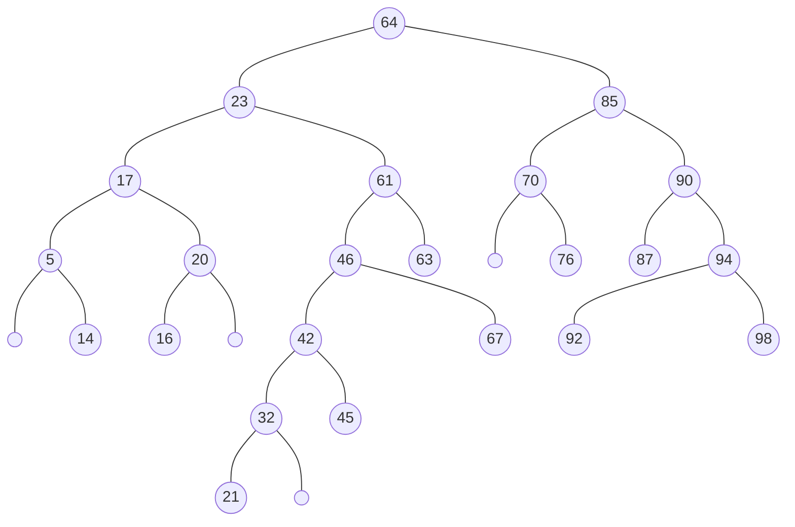

# 1

AVL Trees

## a

Insert the following values in the given order [34, 74, 98, 2, 64, 41, 86, 59, 40, 58, 50, 56, 45, 16, 44] into an empty AVL tree. Show the tree after all insertions.

> [!answer]
> ![[CSDS 233 - Intro to Data Structures/Projects/5/Written/tables#^1aa|tables]]
> ![[CSDS 233 - Intro to Data Structures/Projects/5/Written/tables#^1ab|tables]]
> ![[CSDS 233 - Intro to Data Structures/Projects/5/Written/tables#^1ac|tables]]
> ![[CSDS 233 - Intro to Data Structures/Projects/5/Written/tables#^1ad|tables]]
> ![[CSDS 233 - Intro to Data Structures/Projects/5/Written/tables#^1ae|tables]]
> ![[CSDS 233 - Intro to Data Structures/Projects/5/Written/tables#^1af|tables]]
> ![[CSDS 233 - Intro to Data Structures/Projects/5/Written/tables#^1ag|tables]]
> ![[CSDS 233 - Intro to Data Structures/Projects/5/Written/tables#^1ah|tables]]
> ![[CSDS 233 - Intro to Data Structures/Projects/5/Written/tables#^1ai|tables]]
> ![[CSDS 233 - Intro to Data Structures/Projects/5/Written/tables#^1aj|tables]]
> ![[CSDS 233 - Intro to Data Structures/Projects/5/Written/tables#^1ak|tables]]
> ![[CSDS 233 - Intro to Data Structures/Projects/5/Written/tables#^1al|tables]]
> ![[CSDS 233 - Intro to Data Structures/Projects/5/Written/tables#^1am|tables]]
> ![[CSDS 233 - Intro to Data Structures/Projects/5/Written/tables#^1an|tables]]
> ![[CSDS 233 - Intro to Data Structures/Projects/5/Written/tables#^1ao|tables]]

## b

Add an element to the AVL tree such that it will cause a right rotation of the tree. State the element and show the tree after. Use the tree from part A.

> [!answer]
> 43
> ![[CSDS 233 - Intro to Data Structures/Projects/5/Written/tables#^1b|tables]]

## c

Add an element to the AVL tree such that it will cause a left rotation of the tree. State the element and show the tree after. Use the tree from part B.

> [!answer]
> 17
> ![[CSDS 233 - Intro to Data Structures/Projects/5/Written/tables#^1c|tables]]

## d

Delete an element from the AVL tree such that it will cause a double rotation to the tree. State the element and show the final tree after deletion. Use the tree from part C.

> [!answer]
> Answer brok :(

# 2

Heap

## a

Create a binary max on top heap with the keys [11, 16, 33, 36, 26, 41, 17, 84, 8, 57, 30, 71, 53, 23, 87, 95, 62]. Show the heap after all insertions.

> [!answer]
> [, 11]
> [, 16, 11]
> [, 33, 11, 16]
> [, 36, 33, 16, 11]
> [, 36, 33, 16, 11, 26]
> [, 41, 33, 36, 11, 26, 16]
> [, 41, 33, 36, 11, 26, 16, 17]
> [, 84, 41, 36, 33, 26, 16, 17, 11]
> [, 84, 41, 36, 33, 26, 16, 17, 11, 8]
> [, 84, 57, 36, 33, 41, 16, 17, 11, 8, 26]
> [, 84, 57, 36, 33, 41, 16, 17, 11, 8, 26, 30]
> [, 84, 57, 71, 33, 41, 36, 17, 11, 8, 26, 30, 16]
> [, 84, 57, 71, 33, 41, 53, 17, 11, 8, 26, 30, 16, 36]
> [, 84, 57, 71, 33, 41, 53, 23, 11, 8, 26, 30, 16, 36, 17]
> [, 87, 57, 84, 33, 41, 53, 71, 11, 8, 26, 30, 16, 36, 17, 23]
> [, 95, 87, 84, 57, 41, 53, 71, 33, 8, 26, 30, 16, 36, 17, 23, 11]
> [, 95, 87, 84, 62, 41, 53, 71, 57, 8, 26, 30, 16, 36, 17, 23, 11, 33]
> ![[CSDS 233 - Intro to Data Structures/Projects/5/Written/tables#^2a|tables]]

## b

Show the heap when removing the max value 3 times. Show the steps.

> [!answer]
> ![[CSDS 233 - Intro to Data Structures/Projects/5/Written/tables#^2ba|tables]]
> ![[CSDS 233 - Intro to Data Structures/Projects/5/Written/tables#^2bb|tables]]
> ![[CSDS 233 - Intro to Data Structures/Projects/5/Written/tables#^2bc|tables]]
> ![[CSDS 233 - Intro to Data Structures/Projects/5/Written/tables#^2bd|tables]]
> ![[CSDS 233 - Intro to Data Structures/Projects/5/Written/tables#^2be|tables]]
> ![[CSDS 233 - Intro to Data Structures/Projects/5/Written/tables#^2bf|tables]]

# 3

Given the following tree:

## a

Give post-order, pre-order of the tree.

> [!answer]
> Post-order:
> [14, 5, 16, 20, 17, 21, 32, 45, 42, 67, 46, 63, 61, 23, 76, 70, 87, 92, 98, 94, 90, 85, 64]
> 
> Pre-order:
> [64, 23, 17, 5, 14, 20, 16, 61, 46, 42, 32, 21, 45, 67, 63, 85, 70, 76, 90, 87, 94, 92, 98]

## b

Give level-order and in-order of the tree

> [!answer]
> Level-order:
> [64, 23, 85, 17, 6, 70, 90, 5, 20, 46, 63, 76, 87, 94, 14, 16, 42, 67, 92, 98, 32, 45, 21]
> 
> In-order:
> [5, 14, 17, 16, 20, 23, 21, 32, 42, 45, 46, 67, 61, 63, 64, 70, 76, 85, 87, 90, 92, 94, 98]

## c

When looking for the value 67, give the path traced by breadth first search and depth first search algorithm

> [!answer]
> Breadth first/Level-order:
> [64, 23, 85, 17, 6, 70, 90, 5, 20, 46, 63, 76, 87, 94, 14, 16, 42, 67, 92, 98, 32, 45, 21]
> 
> Depth first/pre-order/post-order (depending on implementation):
> [64, 23, 17, 5, 14, 20, 16, 61, 46, 42, 32, 21, 45, 67, 63, 85, 70, 76, 90, 87, 94, 92, 98]
> [14, 5, 16, 20, 17, 21, 32, 45, 42, 67, 46, 63, 61, 23, 76, 70, 87, 92, 98, 94, 90, 85, 64]

## d

Given a tree with the
preorder: [E, A, B, H, I, F, J, D, G, K, C] and the
inorder: [B, I, H, A, F, E, G, D, K, J, C], draw the binary tree.

> [!answer]
> L<-->R is Inorder
> U<-->D is Preorder
> ![[CSDS 233 - Intro to Data Structures/Projects/5/Written/tables#^3da|tables]]
> ![[CSDS 233 - Intro to Data Structures/Projects/5/Written/tables#^3db|tables]]
