^1aa

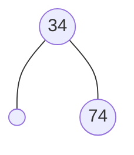
^1ab

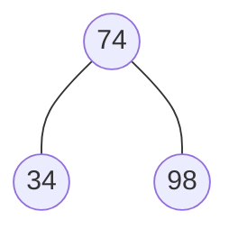
^1ac
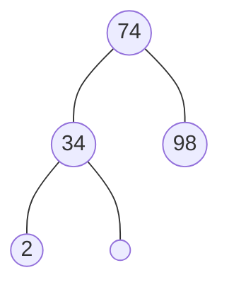
^1ad

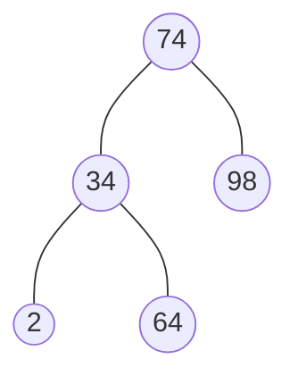
^1ae

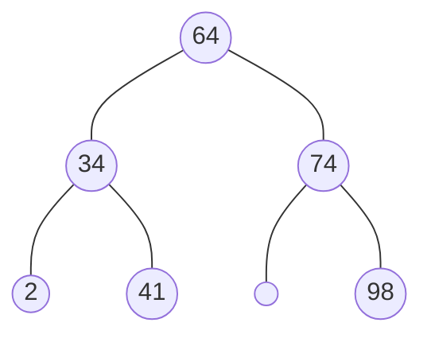
^1af

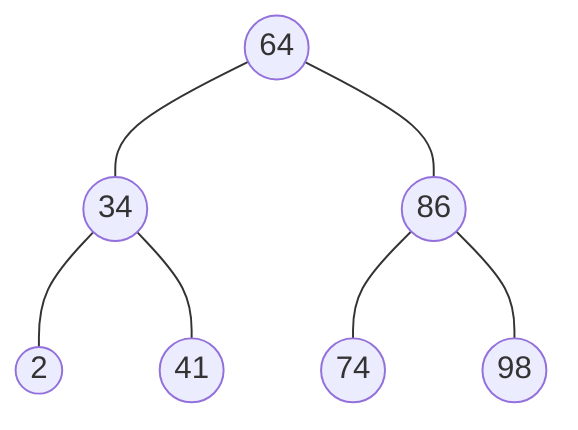
^1ag

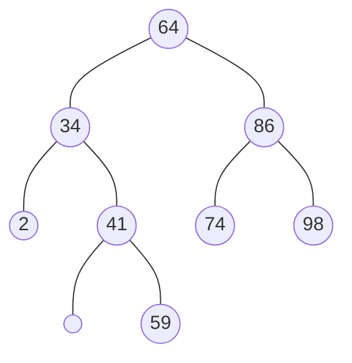
^1ah

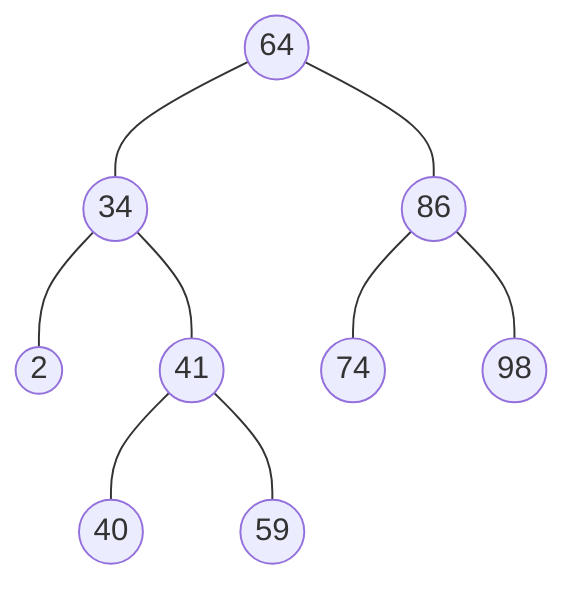
^1ai

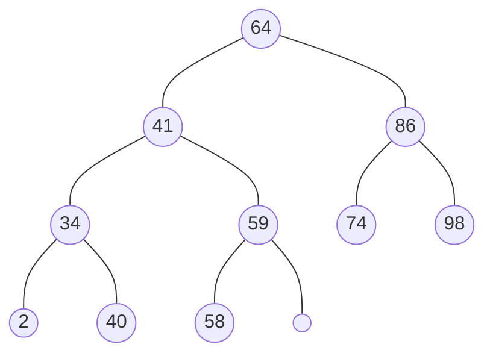
^1aj

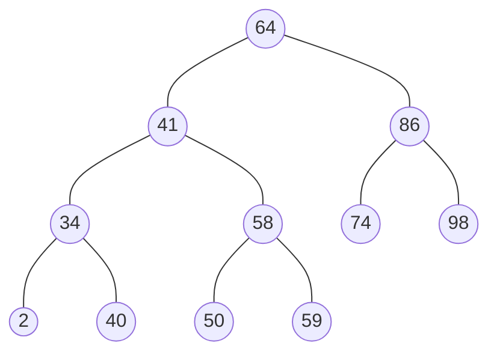
^1ak

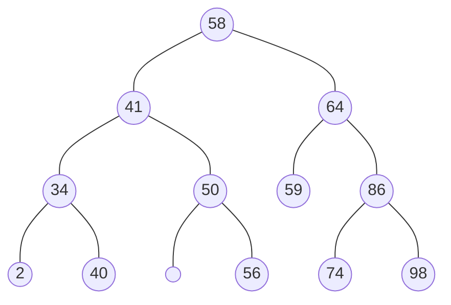
^1al

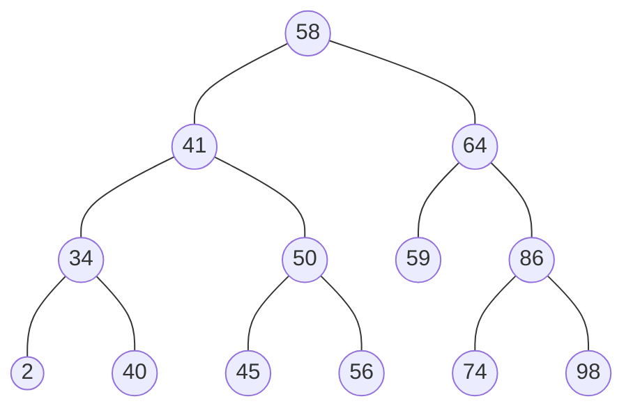
^1am

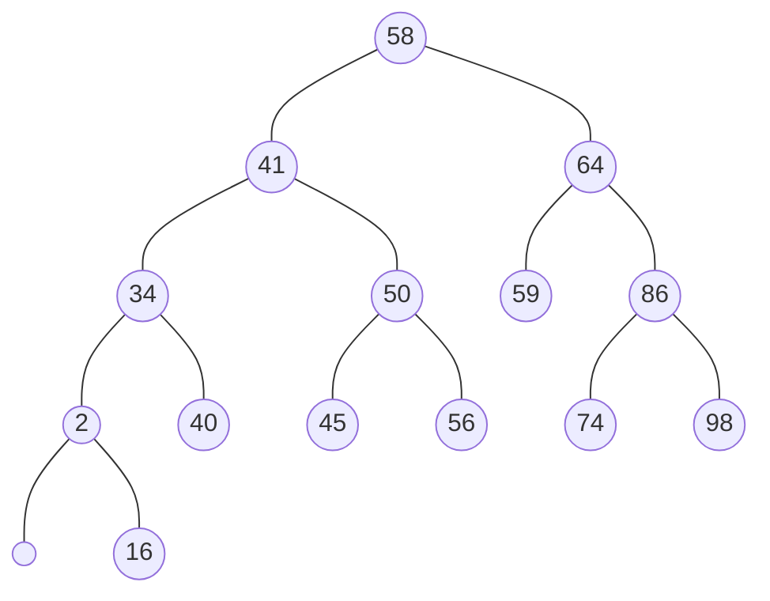
^1an

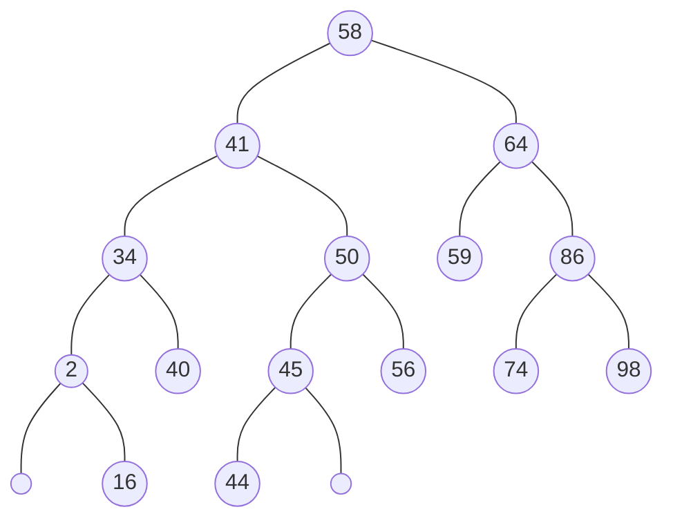
^1ao

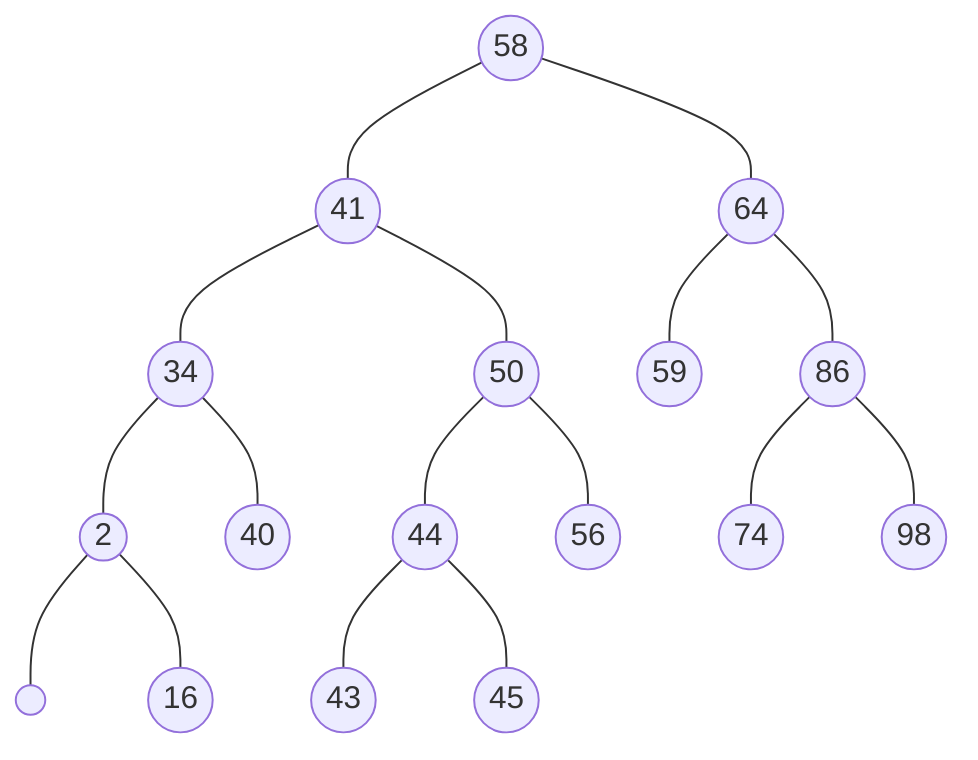
^1b

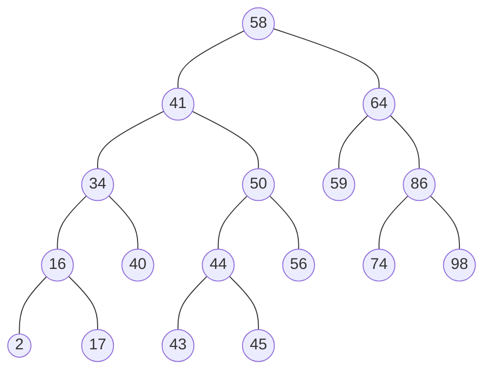
^1c

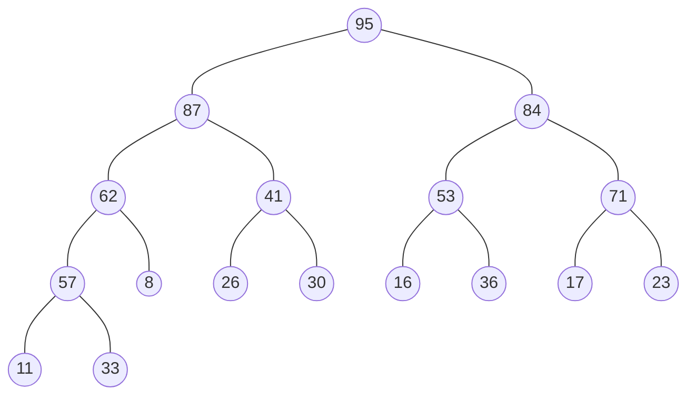
^2a

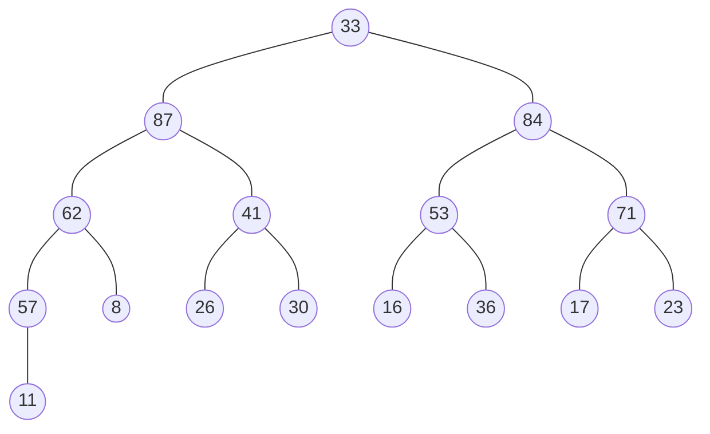
^2ba


^2bb

```mermaid
flowchart TB
11((11)) --- 62((62)) & 84((84))

62 --- 57((57)) & 41((41))
84 --- 53((53)) & 71((71))

57 --- 33((33)) & 8((8))
41 --- 26((26)) & 30((30))
53 --- 16((16)) & 36((36))
71 --- 17((17)) & 23((23))
```
^2bc

```mermaid
flowchart TB
84((84)) --- 62((62)) & 71((71))

62 --- 57((57)) & 41((41))
71 --- 53((53)) & 23((23))

57 --- 33((33)) & 8((8))
41 --- 26((26)) & 30((30))
53 --- 16((16)) & 36((36))
23 --- 17((17)) & 11((11))
```
^2bd

```mermaid
flowchart TB
11((11)) --- 62((62)) & 71((71))

62 --- 57((57)) & 41((41))
71 --- 53((53)) & 23((23))

57 --- 33((33)) & 8((8))
41 --- 26((26)) & 30((30))
53 --- 16((16)) & 36((36))
23 --- 17((17))
```
^2be

```mermaid
flowchart TB
71((71)) --- 62((62)) & 53((53))

62 --- 57((57)) & 41((41))
53 --- 36((36)) & 23((23))

57 --- 33((33)) & 8((8))
41 --- 26((26)) & 30((30))
36 --- 16((16)) & 11((11))
23 --- 17((17))
```
^2bf

```JSON
   ┏━E━━━┓
┏━━A     ┃
B━┓      ┃
 ┏H━┓    ┃
 I  ┃    ┃
    F    ┃
       ┏━J┓
      ┏D┓ ┃
      G ┃ ┃
        K ┃
          C
```
^3da

```mermaid
flowchart TB
E((E)) --- A((A)) & J((J))
A --- B((B)) & F((F))
B --- a(( )) & H((H))
H --- I((I)) & b(( ))
J --- D((D)) & C((C))
D --- G((G)) & K((K))
```
^3db
