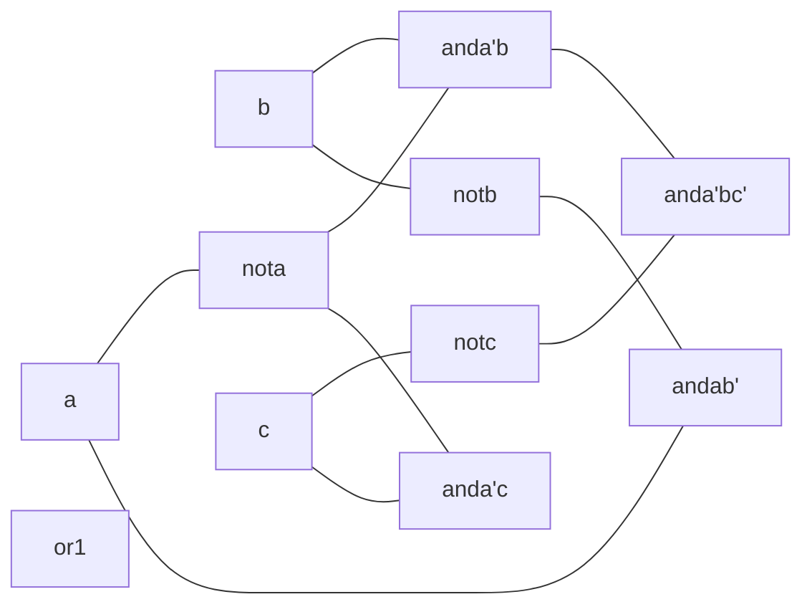

| $a$ | $b$ | $c$ | $F$ |
| --- | --- | --- | --- |
| F   | F   | F   | F    |
| F    | F    | T    | T    |
| F    | T    | F    | T    |
| F    | T    | T    | T    |
| T    | F    | F    | T    |
| T    | F    | T    | T    |
| T    | T    | F    | F    |
| T    | T    | T    | F    |

^3

