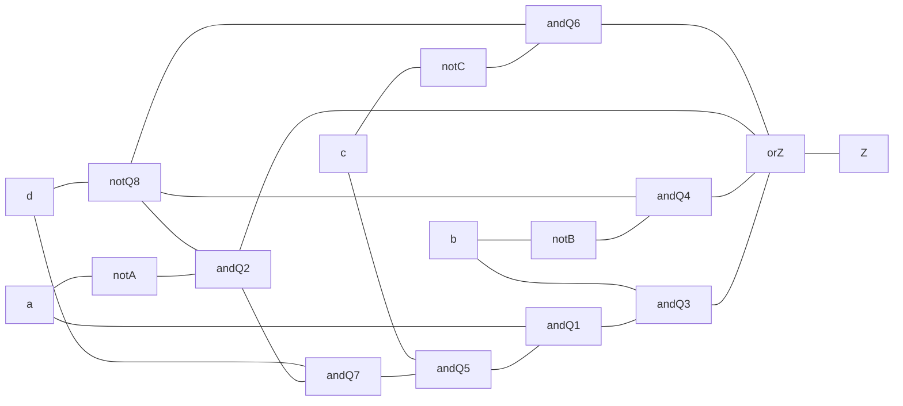

^1

| $A$ | $B$ | $C$ | $D$ | $Z$ |
| ---- | ---- | ---- | ---- | ---- |
| F | F |  |  |  |
| F | F |  |  |  |
| F | T |  |  |  |
| F | T |  |  |  |
| F | F |  |  |  |
| F | F |  |  |  |
| F | T |  |  |  |
| F | T |  |  |  |
| T |  |  |  |  |
| T |  |  |  |  |
| T |  |  |  |  |
|  |  |  |  |  |
|  |  |  |  |  |
|  |  |  |  |  |
|  |  |  |  |  |
|  |  |  |  |  |

| $a$ | $b$ | $c$ | $F$ |
| --- | --- | --- | --- |
| F   | F   | F   | F    |
| F    | F    | T    | T    |
| F    | T    | F    | T    |
| F    | T    | T    | T    |
| T    | F    | F    | T    |
| T    | F    | T    | T    |
| T    | T    | F    | F    |
| T    | T    | T    | F    |

^3

^3b

| $w$ | $x$ | $y$ | $F$ |
| ---- | ---- | ---- | ---- |
| F | F | F | F |
| F | F | T | T |
| F | T | F | F |
| F | T | T | T |
| T | F | F | F |
| T | F | T | F |
| T | T | F | T |
| T | T | T | F |
^4
