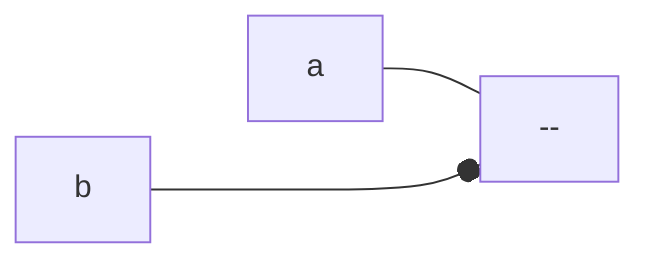

# 1

Simplify the following functions using Karnaugh maps

## a

$F=\sum\limits_{w,x,y,z}(0,1,4,5,7,10,11,14,15)$

> [!answer]
> ![[CSDS 281 - Logic Design/HW/4/Tables#^1a|Tables]]
> 
> $A'\cdot C'+A\cdot C+B\cdot A'\cdot D+B\cdot C\cdot D$

## b

$F=\sum\limits_{w,x,y,z}(0,2,3,4,6,9,10,11,15)$

> [!answer]
> ![[CSDS 281 - Logic Design/HW/4/Tables#^1b|Tables]]
> 
> $A'\cdot D'+B'\cdot C+D\cdot A\cdot B'+C\cdot D\cdot A$

# 2

Simplify the following functions using Karnaugh maps

## a

$F=\sum\limits_{x,y,z}(0,1,3,4,5,6)$

> [!answer]
> ![[CSDS 281 - Logic Design/HW/4/Tables#^2a|Tables]]
> 
> $B'+A\cdot C'+A'\cdot C$

## b

$F=\sum\limits_{x,y,z}(1,2,5,6,7)$

> [!answer]
> ![[CSDS 281 - Logic Design/HW/4/Tables#^2b|Tables]]
> 
> $A\cdot B+B\cdot C'+A\cdot C+B'\cdot C$

# 3

For the logic expressions given below, find all of the static hazards and design a hazard-free circuit that realizes the same logic function. Write the functions that are hazard free, you do not need to draw the circuit. (Hint: Use Karnaugh maps to find the timing hazards.)

## a

$F=W\cdot X+W'\cdot Y'$

> [!answer]
> ![[CSDS 281 - Logic Design/HW/4/Tables#^3a|Tables]]
> 
> $W\cdot X+W'\cdot Y'+X\cdot Y$

## b

$F=W\cdot Y+W'\cdot Z'+X\cdot Y'\cdot Z$

> [!answer]
> ![[CSDS 281 - Logic Design/HW/4/Tables#^3b|Tables]]
> 
> $F=W\cdot Y+W'\cdot Z'+Y\cdot Z'+X\cdot Y'\cdot Z+W'\cdot X\cdot Y'+W\cdot X\cdot Z$

# 4

Draw the circuit for the following function using only two 2-input and one 3-input NOR gates. The complements of the inputs are also available.

$F = a\cdot b + a'\cdot b' + b'\cdot c$

> [!answer]
> $F = a\cdot b + a'\cdot b' + b'\cdot c$
> 
> ![[CSDS 281 - Logic Design/HW/4/Tables#^4|Tables]]
> 
> $F = (a+b')\cdot(a'+b+c)$
> $F = ((a+b')'+(a'+b+c)')'$
> 

# 5

Design a three-input logic circuit that will produce a 1-output when there are more zeros in the input combination than the ones. For example, 001 will produce a 1-output whereas 110 will produce a 0-output. First write the truth table for this problem and then find the minimal sum using a Karnaugh map. Draw the circuit using only NAND gates. The complements of the inputs are available.
