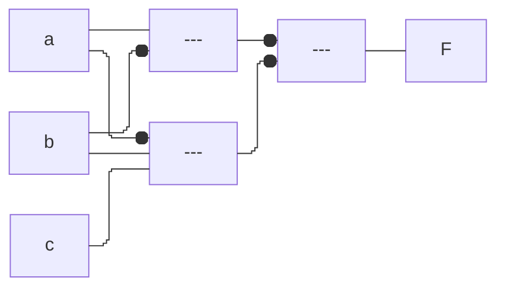

| $w$ | $x$ | $y$ | $z$ | $F$ |
| --- | --- | --- | --- | --- |
| 0   | 0   | 0   | 0   | 1   |
| 0   | 0   | 0   | 1   | 1   |
| 0   | 0   | 1   | 0   | 0   |
| 0   | 0   | 1   | 1   | 0   |
| 0   | 1   | 0   | 0   | 1   |
| 0   | 1   | 0   | 1   | 1   |
| 0   | 1   | 1   | 0   | 0   |
| 0   | 1   | 1   | 1   | 1   |
| 1   | 0   | 0   | 0   | 0   |
| 1   | 0   | 0   | 1   | 0   |
| 1   | 0   | 1   | 0   | 1   |
| 1   | 0   | 1   | 1   | 1   |
| 1   | 1   | 0   | 0   | 0   |
| 1   | 1   | 0   | 1   | 0   |
| 1   | 1   | 1   | 0   | 1   |
| 1   | 1   | 1   | 1   | 1   | 

| CD\\AB | 00  | 01  | 11  | 10  |
| ------ | --- | --- | --- | --- |
| 00     | 0   | 4   | 12  | 8   |
| 01     | 1   | 5   | 13  | 9   |
| 11     | 3   | 7   | 15  | 11  |
| 10     | 2   | 6   | 14  | 10  |

| CD\\AB | 00  | 01  | 11  | 10  |
| ------ | --- | --- | --- | --- |
| 00     | 1    | 1    | 0    | 0    |
| 01     | 1    | 1    | 0    | 0    |
| 11     | 0    | 1    | 1    | 1    |
| 10     | 0    | 0    | 1    | 1    |
^1a

| CD\\AB | 00  | 01  | 11  | 10  |
| ------ | --- | --- | --- | --- |
| 00     | 1    | 1    | 0    | 0    |
| 01     | 0    | 0    | 0    | 1    |
| 11     | 1    | 0    | 1    | 1    |
| 10     | 1    | 1    | 0    | 1    |
^1b

| C\\AB | 00 | 01 | 11 | 10 |
| ---- | ---- | ---- | ---- | ---- |
| 0 | 0 | 2 | 6 | 4 |
| 1 | 1 | 3 | 7 | 5 |

| C\\AB | 00 | 01 | 11 | 10 |
| ---- | ---- | ---- | ---- | ---- |
| 0 | 1 | 0 | 1 | 1 |
| 1 | 1 | 1 | 0 | 1 |
^2a

| C\\AB | 00 | 01 | 11 | 10 |
| ---- | ---- | ---- | ---- | ---- |
| 0 | 0 | 1 | 1 | 0 |
| 1 | 1 | 0 | 1 | 1 |
^2b

| Y\\WX | 00 | 01 | 11 | 10 |
| ---- | ---- | ---- | ---- | ---- |
| 0 | 0 | 0 | **1** | 0 |
| 1 | *1* | *1* | **1** | 0 |
^3a

| YZ\\WX | 00  | 01  | 11  | 10  |
| ------ | --- | --- | --- | --- |
| 00     | *1*    | *1*    | 0    | 0    |
| 01     | 0    | 1    | 1    | 0    |
| 11     | 0    | 0    | **1**    | **1**    |
| 10     | *1*    | *1*    | **1**    | **1**    |
^3b

| c\\ab | 00 | 01 | 11 | 10 |
| ---- | ---- | ---- | ---- | ---- |
| 0 | 1 | 0 | 1 | 0 |
| 1 | 1 | 0 | 1 | 1 |
^4

^4a