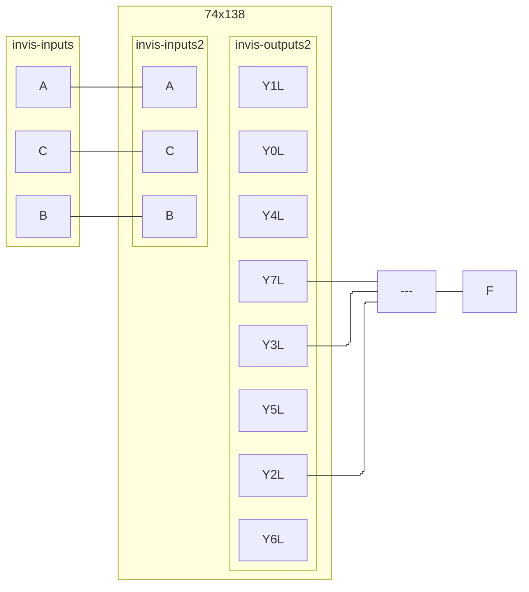

| C\AB | 00  | 01  | 11  | 10  |
| ---- | --- | --- | --- | --- |
| 0    | 0   | 1   | 3   | 2   |
| 1    | 4   | 5   | 7   | 6   |

| CD\AB | 00  | 01  | 11  | 10  |
| ----- | --- | --- | --- | --- |
| 00    | 0   | 1   | 3   | 2   |
| 01    | 4   | 5   | 7   | 6   |
| 11    | 12  | 13  | 15  | 14  |
| 10    | 8   | 9   | 11  | 10  |

| C\AB | 00  | 01  | 11  | 10  |
| ---- | --- | --- | --- | --- |
| 0    | 0   | 0   | 1   | 1   |
| 1    | 0   | 0   | 1   | 0   |
^1at

| CD\AB | 00  | 01  | 11  | 10  |
| ----- | --- | --- | --- | --- |
| 00    | 0   | 1   | 0   | 0   |
| 01    | 1   | 0   | 0   | 1   |
| 11    | 0   | 0   | 1   | 0   |
| 10    | 0   | 1   | 1   | 0   |
^1bt


^1a

```mermaid
%%{ init: { 'flowchart': { 'curve': 'stepBefore', "defaultRenderer": "elk" } } }%%
flowchart LR
subgraph invis-inputs
A
B
C
D
end
subgraph 74x138
subgraph invis-inputs2
A --- Aa["A"]
B --- Bb["B"]
C --- Cc["C"]
end
subgraph invis-outputs2
Y0L
Y1L
Y2L
Y3L
Y4L
Y5L
Y6L
Y7L
end
invis-inputs2 ~~~ invis-outputs2
end
invid-logic
direction TB
Y1L & Y4L & Y6L --- nand1[---]
Y1L & Y3L & Y7L --- nand2[---]
nand1 --- nand3[---]
D ---o nand3[---]
nand2 & D --- nand4[---]
nand3 & nand4 ---o nand5[---]
end
nand5 --- F
```
^1b