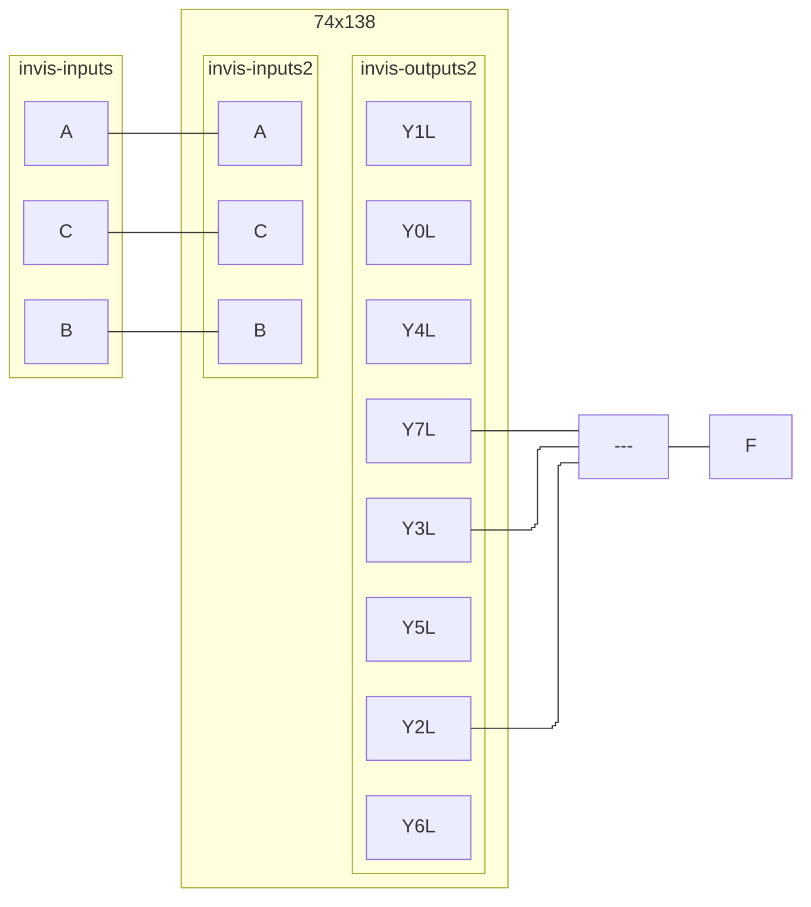
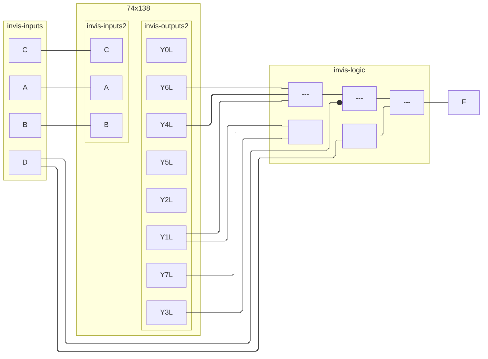
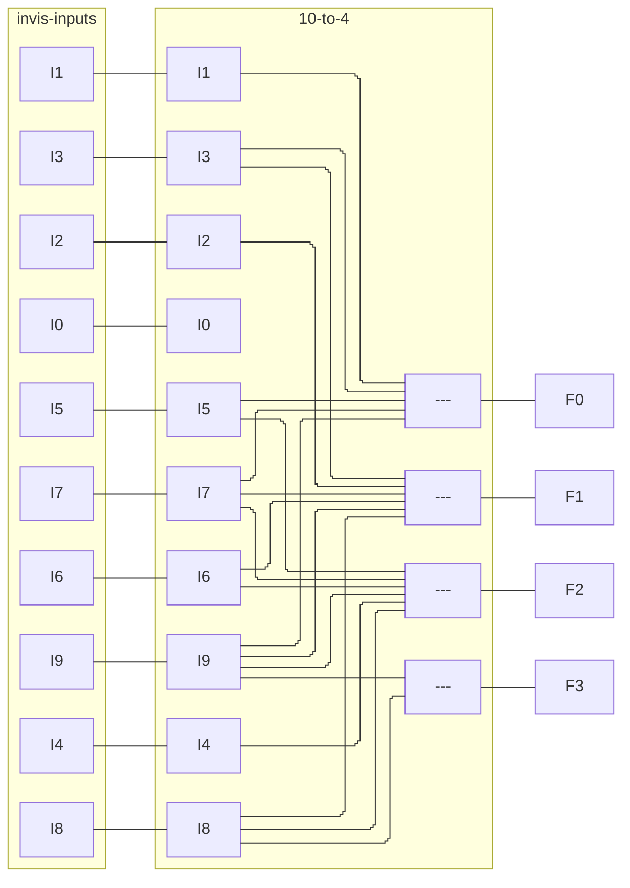
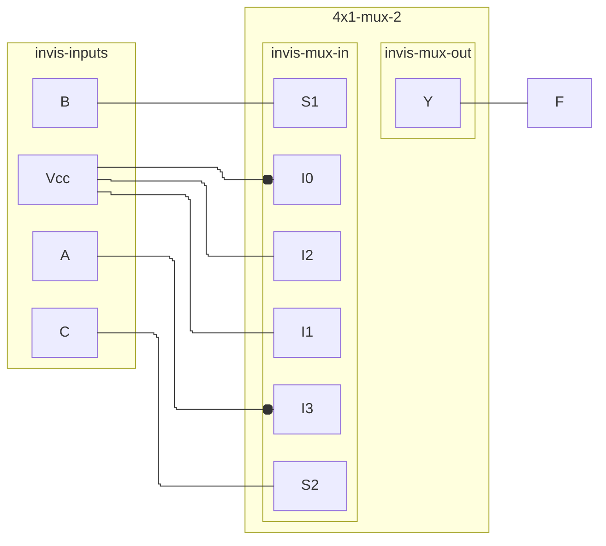
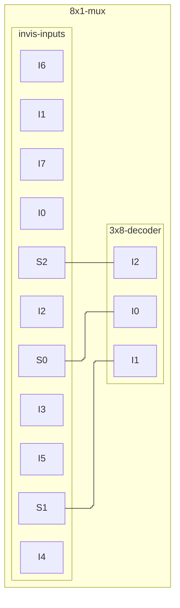

| C\AB | 00  | 01  | 11  | 10  |
| ---- | --- | --- | --- | --- |
| 0    | 0   | 1   | 3   | 2   |
| 1    | 4   | 5   | 7   | 6   |

| CD\AB | 00  | 01  | 11  | 10  |
| ----- | --- | --- | --- | --- |
| 00    | 0   | 1   | 3   | 2   |
| 01    | 4   | 5   | 7   | 6   |
| 11    | 12  | 13  | 15  | 14  |
| 10    | 8   | 9   | 11  | 10  |

| C\AB | 00  | 01  | 11  | 10  |
| ---- | --- | --- | --- | --- |
| 0    | 0   | 0   | 1   | 1   |
| 1    | 0   | 0   | 1   | 0   |
^1at

| CD\AB | 00  | 01  | 11  | 10  |
| ----- | --- | --- | --- | --- |
| 00    | 0   | 1   | 0   | 0   |
| 01    | 1   | 0   | 0   | 1   |
| 11    | 0   | 0   | 1   | 0   |
| 10    | 0   | 1   | 1   | 0   |
^1bt

^1a

^1b

| I   | Y3  | Y2  | Y1  | Y0  |
| --- | --- | --- | --- | --- |
| 0   | 0   | 0   | 0   | 0   |
| 1   | 0   | 0   | 0   | 1   |
| 2   | 0   | 0   | 1   | 0   |
| 3   | 0   | 0   | 1   | 1   |
| 4   | 0   | 1   | 0   | 0   |
| 5   | 0   | 1   | 0   | 1   |
| 6   | 0   | 1   | 1   | 0   |
| 7   | 0   | 1   | 1   | 1   |
| 8   | 1   | 1   | 1   | 0   |
| 9   | 1   | 1   | 1   | 1   |
^2t

^2

^3

| Y\WX | 00    | 01    | 11  | 10  |
| ---- | ----- | ----- | --- | --- |
| 0    | **1** | **1** | *1* | 0   |
| 1    | 0     | 0     | *1* | 0   |
^4a

| YZ\WX | 00  | 01  | 11    | 10    |
| ----- | --- | --- | ----- | ----- |
| 00    | 0   | 0   | 0     | 0     |
| 01    | *1* | *1* | 1     | 0     |
| 11    | *1* | *1* | **1** | **1** |
| 10    | 0   | 0   | **1** | **1** |
^4b

^5