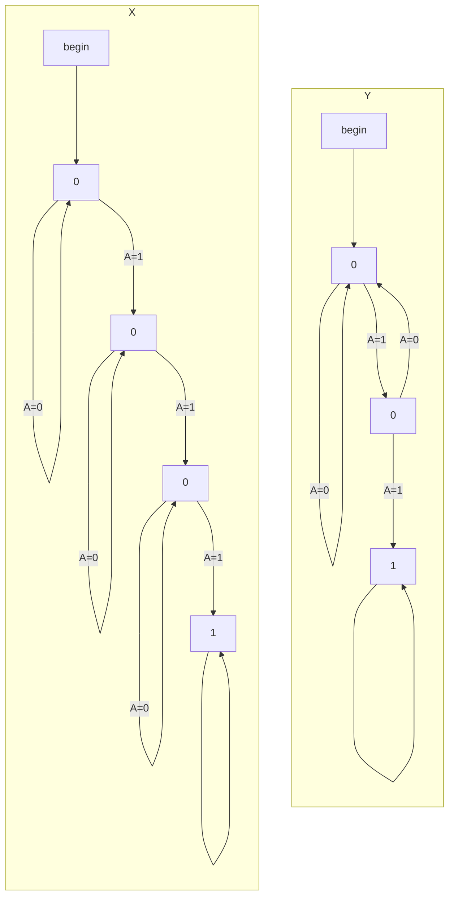
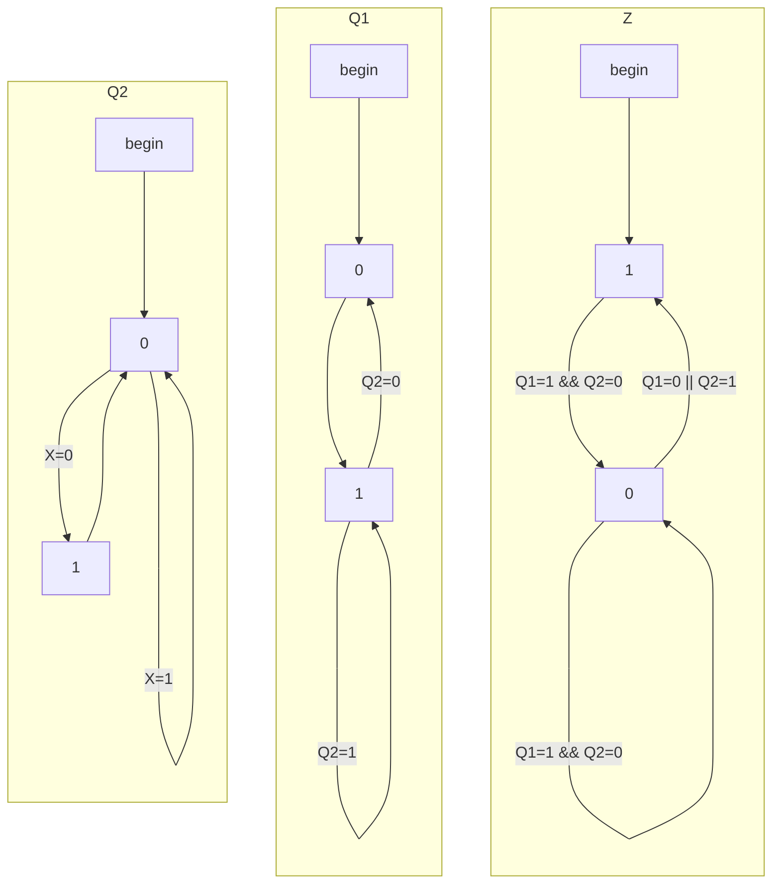

^1



^2a

| Q1  | Q2  | X   | D1  | D2  | Z   |
| --- | --- | --- | --- | --- | --- |
| 0   | 0   | 0   | 1   | 1   | 1   |
| 0   | 0   | 1   | 1   | 0   | 1   |
| 0   | 1   | 0   | 1   | 0   | 1   |
| 0   | 1   | 1   | 1   | 0   | 1   |
| 1   | 0   | 0   | 0   | 1   | 0   |
| 1   | 0   | 1   | 0   | 0   | 0   |
| 1   | 1   | 0   | 1   | 0   | 1   |
| 1   | 1   | 1   | 1   | 0   | 1   |
^2b

```mermaid
%%{ init: { 'flowchart': { 'curve': 'stepBefore', "defaultRenderer": "elk" } } }%%
flowchart LR
subgraph invis-inputs
X
end
subgraph invis-logic
subgraph D1
subgraph invis-D1-inputs
D1[D]
end
subgraph invis-D1-outputs
Q1[Q]
Q1P[Q']
end
invis-D1-inputs ~~~ invis-D1-outputs
end
subgraph D2
subgraph invis-D2-inputs
D2[D]
end
subgraph invis-D2-outputs
Q2[Q]
Q2P[Q']
end
invis-D2-inputs ~~~ invis-D2-outputs
end
end
subgraph invis-outputs
Z
end
```