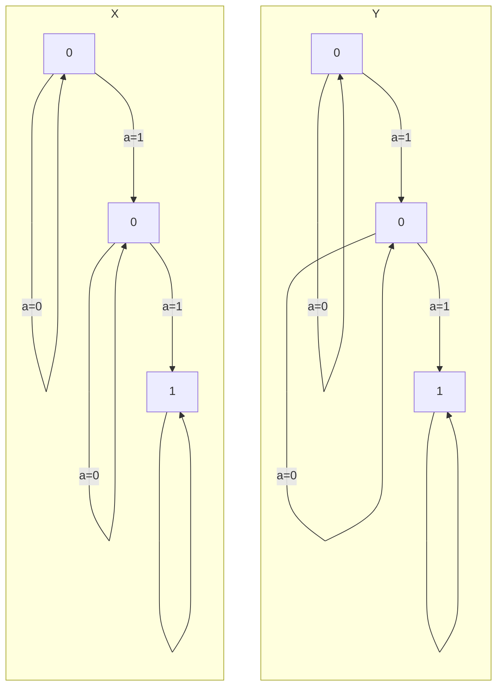

```mermaid
flowchart LR
subgraph X
01x[0] --->|a=0| 01x
01x --->|a=1| 02x[0]
02x --->|a=0| 02x
02x --->|a=1| 1x[1]
1x ---> 1x
end
X ~~~ Y
subgraph Y
01[0] --->|a=0| 01
01 --->|a=1| 02[0]
02 --->|a=0| 02
02 --->|a=1| 1
1 ---> 1
end
```
