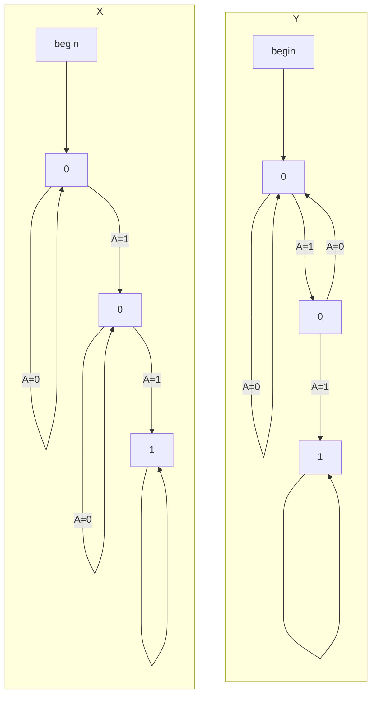

```mermaid
flowchart LR
subgraph X
beginx[begin] ---> 01x
01x[0] --->|A=0| 01x
01x --->|A=1| 02x[0]
02x --->|A=0| 02x
02x --->|A=1| 1x[1]
1x ---> 1x
end
X ~~~ Y
subgraph Y
beginy[begin] ---> 01y
01y[0] --->|A=0| 01y
01y --->|A=1| 02y[0]
02y --->|A=0| 01y
02y --->|A=1| 1y[1]
1y ---> 1y
end
```
