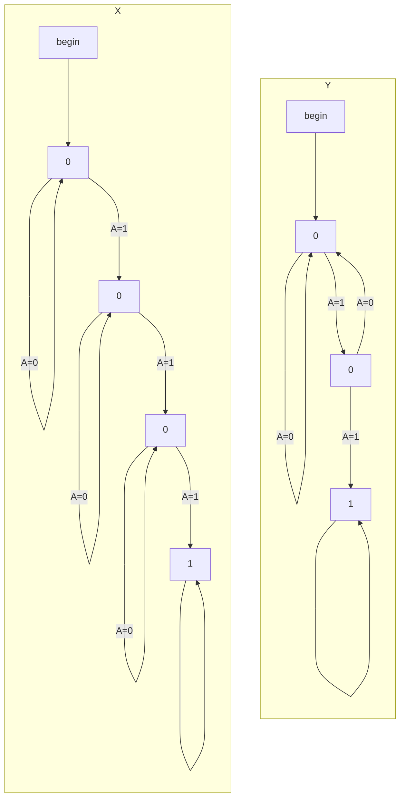
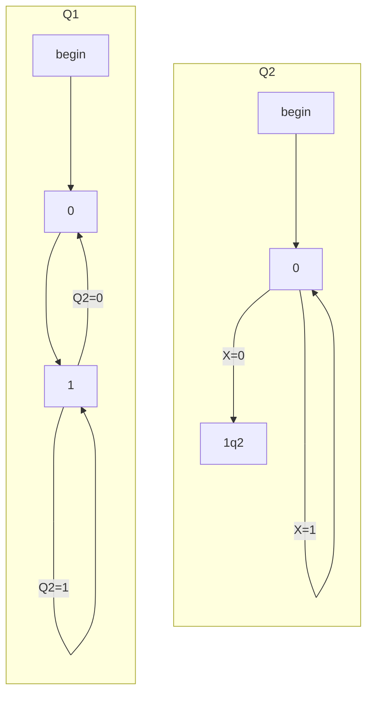

```mermaid
flowchart LR
subgraph X
beginx[begin] ---> 01x
01x[0] --->|A=0| 01x
01x --->|A=1| 02x[0]
02x --->|A=0| 02x
02x --->|A=1| 03x[0]
03x --->|A=0| 03x
03x --->|A=1| 1x[1]
1x ---> 1x
end
X ~~~ Y
subgraph Y
beginy[begin] ---> 01y
01y[0] --->|A=0| 01y
01y --->|A=1| 02y[0]
02y --->|A=0| 01y
02y --->|A=1| 1y[1]
1y ---> 1y
end
```
^1

```mermaid
flowchart LR
subgraph Q1
beginq1[begin] ---> 0q1[0]
0q1 ---> 1q1[1]
1q1 --->|Q2=1| 1q1 
1q1 --->|Q2=0| 0q1
end
Q1 ~~~ Q2
subgraph Q2
beginq2[begin] ---> 0q2[0]
0q2 --->|X=0| 1q2
0q2 --->|X=1| 0q2

end
```
^2