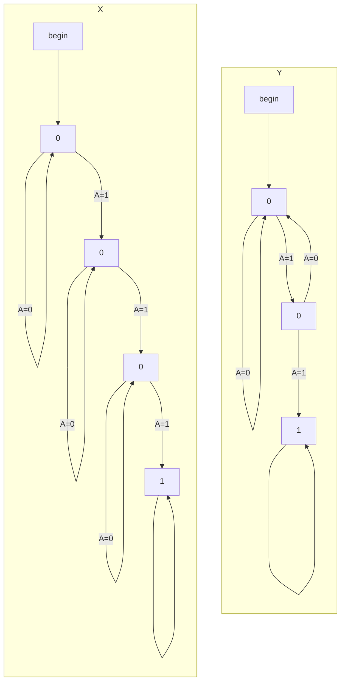
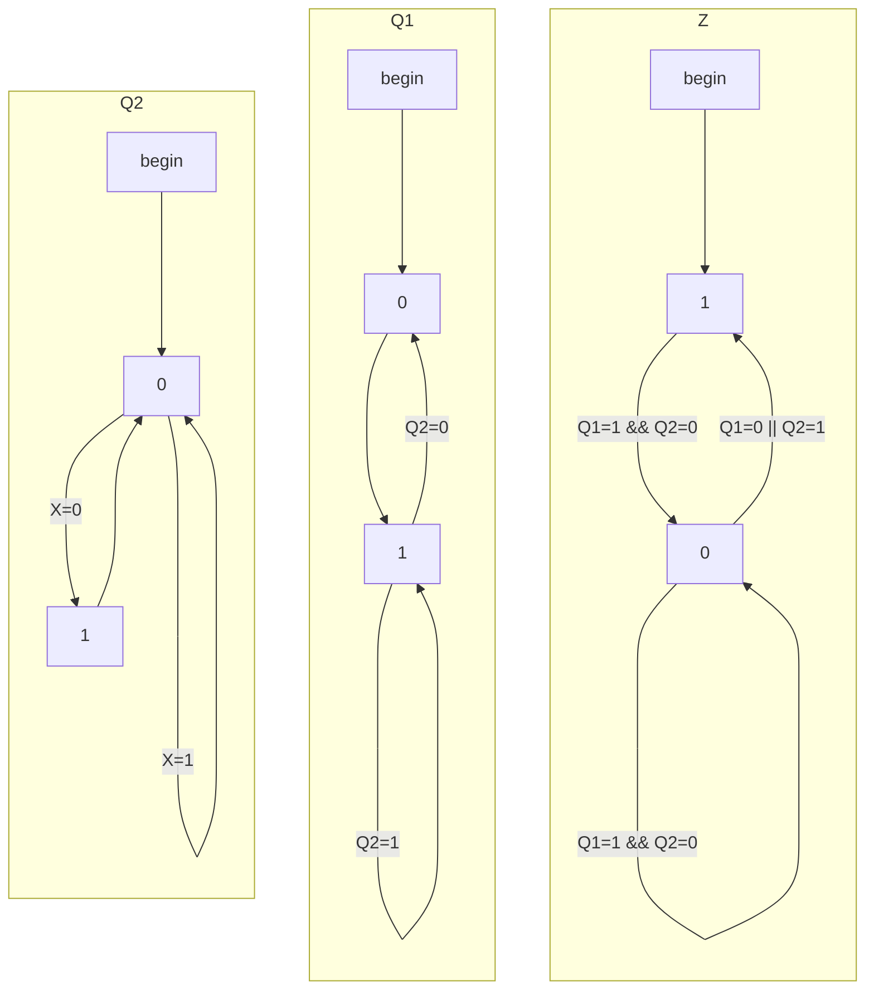
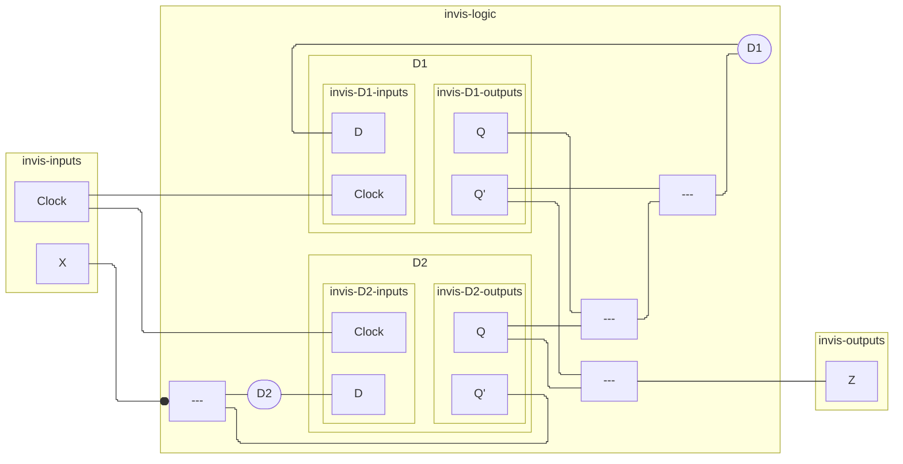
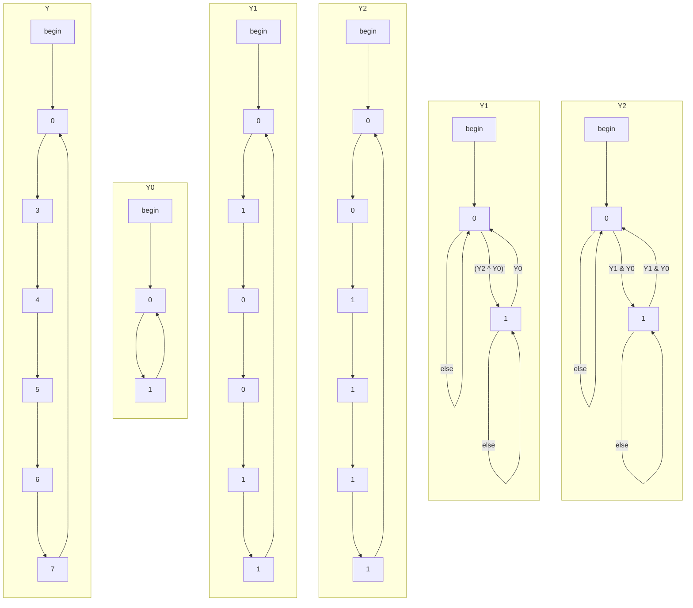
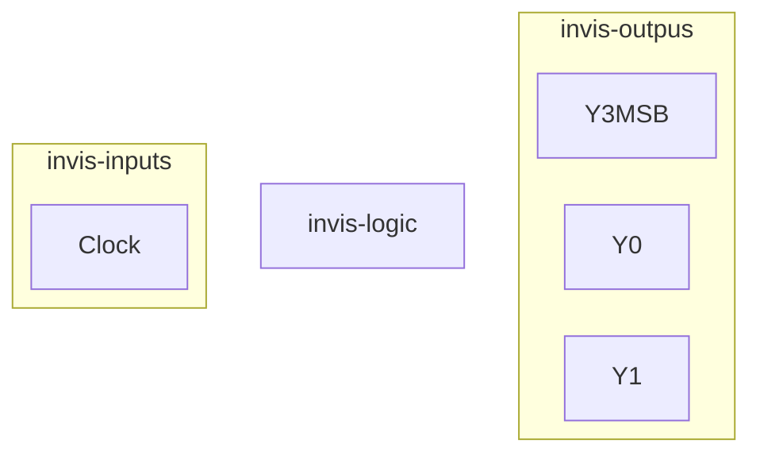

^1

^2a

| Q1  | Q2  | X   | D1  | D2  | Z   |
| --- | --- | --- | --- | --- | --- |
| 0   | 0   | 0   | 1   | 1   | 1   |
| 0   | 0   | 1   | 1   | 0   | 1   |
| 0   | 1   | 0   | 1   | 0   | 1   |
| 0   | 1   | 1   | 1   | 0   | 1   |
| 1   | 0   | 0   | 0   | 1   | 0   |
| 1   | 0   | 1   | 0   | 0   | 0   |
| 1   | 1   | 0   | 1   | 0   | 1   |
| 1   | 1   | 1   | 1   | 0   | 1   |
^2b

^2c

^3a

| Y2  | Y1  | Y0  | Y2* | Y1* | Y0* |
| --- | --- | --- | --- | --- | --- |
| 0   | 0   | 0   | 0   | 1   | 1   |
| 0   | 1   | 1   | 1   | 0   | 0   |
| 1   | 0   | 0   | 1   | 0   | 1   |
| 1   | 0   | 1   | 1   | 1   | 0   |
| 1   | 1   | 0   | 1   | 1   | 1   |
| 1   | 1   | 1   | 0   | 0   | 0   |
^3b

