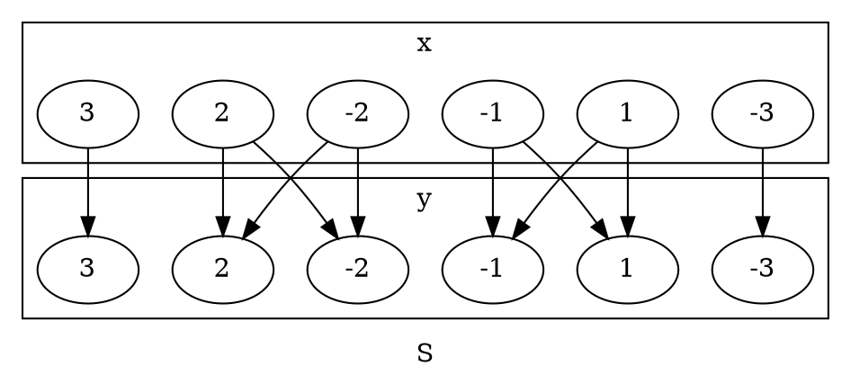
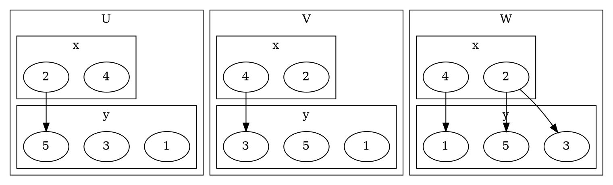
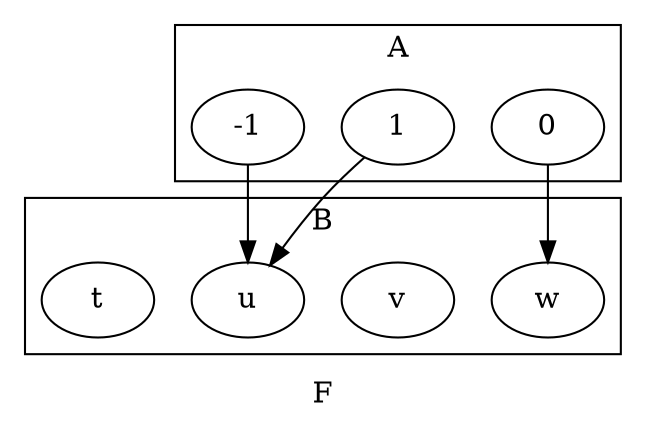
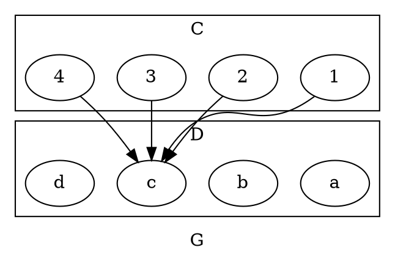
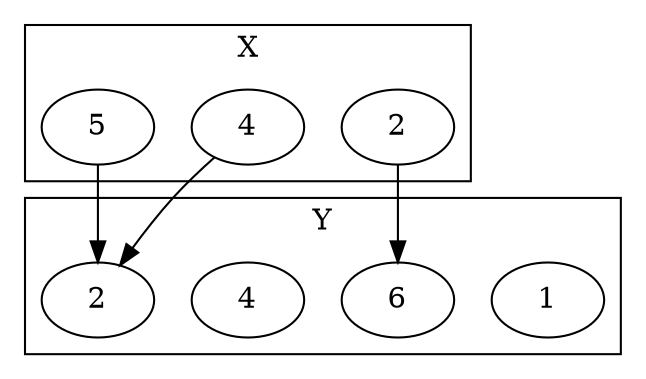
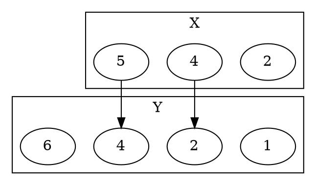
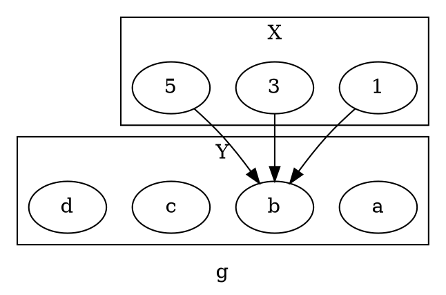
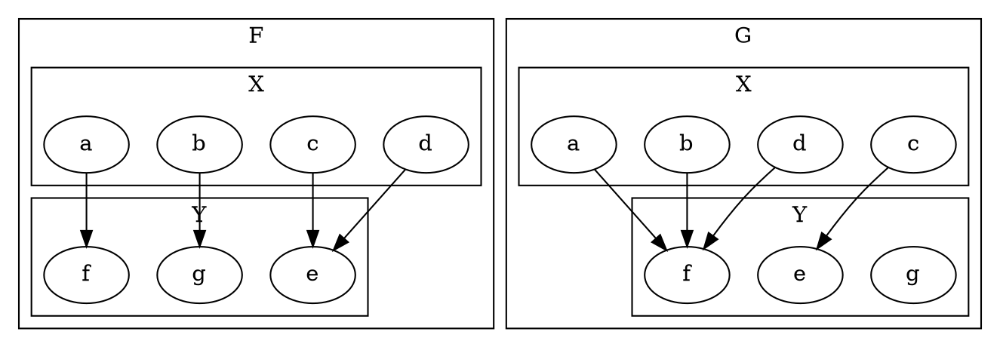
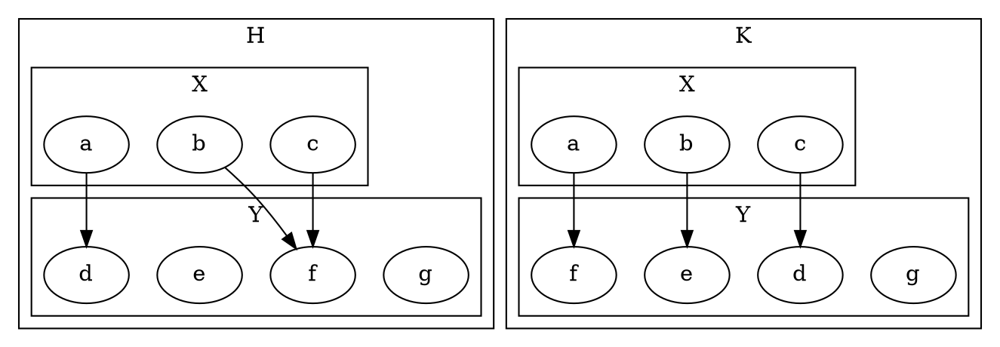

# 1.2

## 3

### a

Is $4=\{4\}$

> [!answer]
> No, 4 is not a set, and 4 itself is not the same as a set containing 4.

### b

How many elements are in the set $\{3, 4, 3, 5\}$

> [!answer]
> There are 3 unique elements in the set.

### c

How many elements are in the set $\{1, \{1\}, \{1, \{1\}\}\}$

> [!answer]
> 3 elements: $1$, $\{1\}$, and $\{1, \{1\}\}$

## 6

For each integer $n$, let $T_n=\{n,n^2\}$ How many elements are in each of $T_2,T_{-3},T_1,T_0$?

> [!answer]
> $T_2=\{2,4\}$, 2 Elements
> $T_{-3}=\{-3,9\}$, 2 Elements
> $T_1=\{1\}$, 1 Element
> $T_0=\{0\}$, 1 Element

## 7

Use the set-roster notation to indicate the elements in each of the following sets

### a

$S=\{n\in\mathbf Z|n=(-1)^k,\text{ for some integer }k\}$

> [!answer]
> $S=\{-1, 1\}$

### e

$W=\{t\in\mathbf Z|1<t<-3\}$

> [!answer]
> $W=\varnothing$

### f

$X=\{u\in\mathbf Z|u\le4\cup u\ge1\}$

> [!answer]
> $X=\mathbf Z$

## 9

### c

Is $\{2\}\in\{1,2\}$?

> [!answer]
> No, the set of 2 is not in the other set

### g

Is $\{1\}\subseteq\{1,2\}$

> [!answer]
> Yes, the set of 1 is a subset of the set of 1 and 2

## 10

### b

Is $(5,-5)=(-5,5)$

> [!answer]
> No, the order matters in ORDERED pairs

### d

Is $\left( \frac{-2}{-4},(-2)^3 \right)=\left( \frac{3}{6},-8 \right)$

> [!answer]
> Yes, both ordered pairs are equal to $(0.5,-8)$

## 12

Let $S=\{2, 4, 6\}$ and $T=\{1,3,5\}$. Use the set-roster notation to write each of the following sets, and indicate the number of elements that are in each set.

### a

$S\times T$

> [!answer]
> $\{(2,1),(2,3),(2,5),(4,1),(4,3),(4,5),(6,1),(6,3),(6,5)\}$
>
> $\|S\times T\|=9$

### c

$S\times S$

> [!answer]
> $\{(2,2),(2,4),(2,6),(4,2),(4,4),(4,6),(6,2),(6,4),(6,6)\}$
>
> $\|S\times S\|=9$

# 1.3

## 2

Let $C=D=\{-3,-2,-1,1,2,3\}$ and define a relation $S$ from $C$ to $D$ as follows: $\forall (x,y)\in C\times D\cap \frac{1}{x}- \frac{1}{y}\in \mathbf Z, (x,y)\in S$

### a

Is $2S2$? Is $-1S-1$? Is $(3,3)\in S$ Is $(3,-3)\in S$

> [!answer]
>
> - Yes, as $\frac{1}{2}-\frac{1}{2}=0\in\mathbf Z$
> - Yes, as $-\frac{1}{1}+\frac{1}{1}=0\in\mathbf Z$
> - Yes, as $\frac{1}{3}-\frac{1}{3}=0\in\mathbf Z$
> - No, as $\frac{1}{3}+\frac{1}{3}=\frac{2}{3}\not\in\mathbf Z$

### b

Write $S$ as a set of ordered pairs.

> [!answer]
> $S=\{(-3,-3), (-2,-2), (-2,2), (-1,-1), (-1,1),$
> $(1,-1), (1, 1), (2, -2), (2, 2), (3, 3)\}$

### c

Write the domain and co-domain of $S$

> [!answer]
> The domain and co-domain of $S$ are both $C=D$

### d

Draw an arrow diagram for $S$

````ad-answer

````

## 8

Let $A=\{2,4\}$ and $B=\{1,3,5\}$ and define relations $U$, $V$, and $W$ from $A$ to $B$ as follows:

- $(x,y)\in U \iff y-x>2, (x,y)\in A\times B$
- $(x,y)\in V \iff y-1= \frac{x}{2}, (x,y)\in A\times B$
- $W=\{(2,5),(4,1),(2,3)\}$

### a

Draw arrow diagrams for $U,V,W$

````ad-answer

````

### b

Indicate whether any of the relations $U,V,W$ are functions

> [!answer]
> $U,V$ are not functions as they do not map some items in the domain and $W$ is not a function as an item in the domain is mapped to multiple items in the co-domain

## 13

Let $A=\{-1,0,1\}$ and $B=\{t,u,v,w\}$ define a function $F:A\to B$ by the following arrow diagram:



### a

Write the domain and co-domain of $F$

> [!answer]
> $A,B$ are the domain and co-domain, in that order

### b

Find $F(-1),F(0),F(1)$

> [!answer]
> $F(-1)=u$
> $F(0)=w$
> $F(1)=u$

## 14

Let $C=\{1,2,3,4\}$ and $D=\{a,b,c,d\}$ define a function $G:C\to D$ by the following arrow diagram:



### a

Write the domain and co-domain of $G$

> [!answer]
> $C,D$ are the domain and co-domain, in that order

### b

Find $G(1),G(2),G(3),G(4)$

> [!answer]
> $G(1)=c$
> $G(2)=c$
> $G(3)=c$
> $G(4)=c$

## 15

Let $X=\{2,4,5\}$ and $Y=\{1,2,4,6\}$. Which of the following diagrams determine functions from $X$ to $Y$

### d



> [!answer]
> Yes, this is a function as all inputs have one and only one output

### e



> [!answer]
> No, this is not a function as not all items in the domain are mapped

## 18

Let $h(r)=2:r\in\mathbf Q$
Find $h\left( -\frac{12}{5} \right),h\left( \frac{0}{1} \right),h\left( \frac{9}{17} \right)$

> [!answer]
> $h\left( -\frac{12}{5} \right)=2$
> $h\left( \frac{0}{1} \right)=2$
> $h\left( \frac{9}{17} \right)=2$

## 20

Define functions $H$ and $K$ from $\mathbf R$ to $\mathbf R$ by the following formulas:
- $H(x)=(x-2)^2:x\in\mathbf R$
- $K(x)=(x-1)(x-3)+1:x\in\mathbf R$

> [!answer]
> $H(x)=x^2-4x+4:x\in\mathbf R$
> $K(x)=x^2-4x+4:x\in\mathbf R$
> Thus, yes, $H=K:\mathbf R$

# 7.1

## 2

Let $X=\{1,3,5\}$ and $Y=\{a,b,c,d\}$ defind $g:X\to Y$ by the following arrow diagram



### a

Write the comain of $g$ and the co-domain of $g$

> [!answer]
> The domain and co-domain are $X,Y$ in that order

### b

Find $g(1),g(3),g(5)$

> [!answer]
> $g(1)=b$
> $g(3)=b$
> $g(5)=b$

### c

What is the range of $g$?

> [!answer]
> The range of $g$ is $\{b\}\subset Y$

### d

Is $3$ an inverse image of $a$? Is $1$ and inverse image of $b$?

> [!answer]
> No not both because the inverse image is a set, but $1$ would be in the inverse image of $b$
> $1\in g^{-1}(b)$

### e

What is the inverse image of $b$? of $c$?

> [!answer]
> $g^{-1}(b)=\{1,3,5\}$
> $g^{-1}(c)=\varnothing$

### f

Represent $g$ as a set of ordered pairs

> [!answer]
> $g=\{(1,b),(3,b),(5,b)\}$

## 4

### b

Find all functions from $X=\{a,b,c\}\to Y=\{u\}$

> [!answer]
> As all inputs must be mapped to the co-domain and there is only one possible choice in the co-domain, there is only one valid function:
> $f(x)=u:x\in X$

# 7.2

## 7

Let $X=\{a,b,c,d\}$ and $Y=\{e,f,g\}$ define functions $F$ and $G$ on $X$ to $Y$ by the arrow diagrams below



### b

Is $G$ one-to-one? Why or why not? Is it onto? Why or why not?

> [!answer]
> No, $G$ is not one-to-one as $a,b,d$ all map to $f$ through $G$.
> No, $G$ is not onto as there is no $x\in X$ mapped to $g\in Y$

## 8

Let $X=\{a,b,c\}$ and $Y=\{d,e,f,g\}$ define functions $H$ and $K$ on $X$ to $Y$ by the arrow diagrams below



### a

Is $H$ one-to-one? Why or why not? Is it onto? Why or why not?

### b

Is $K$ one-to-one? Why or why not? Is it onto? Why or why not?
