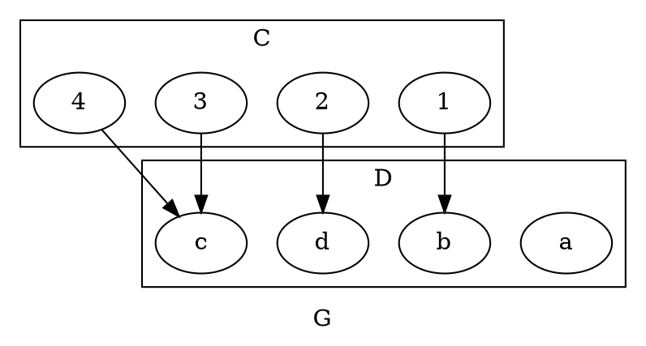

# 1.2

## 3

> [!question] a
> Is $4=\{4\}$

No, 4 is not a set, and 4 itself is not the same as a set containing 4.

> [!question] b
> How many elements are in the set $\{3, 4, 3, 5\}$

There are 3 unique elements in the set.

> [!question] c
> How many elements are in the set $\{1, \{1\}, \{1, \{1\}\}\}$

3 elements: $1$, $\{1\}$, and $\{1, \{1\}\}$

## 6

> [!question]
> For each integer $n$, let $T_n=\{n,n^2\}$ How many elements are in each of $T_2,T_{-3},T_1,T_0$?

$T_2=\{2,4\}$, 2 Elements
$T_{-3}=\{-3,9\}$, 2 Elements
$T_1=\{1\}$, 1 Element
$T_0=\{0\}$, 1 Element

## 7

> [!info] 7
> Use the set-roster notation to indicate the elements in each of the following sets

> [!question] a
> $S=\{n\in\mathbf Z|n=(-1)^k,\text{ for some integer }k\}$

$S=\{-1, 1\}$

> [!question] e
> $W=\{t\in\mathbf Z|1<t<-3\}$

$W=\varnothing$

> [!question] f
> $X=\{u\in\mathbf Z|u\le4\cup u\ge1\}$

$X=\mathbf Z$

## 9

> [!question] c
> Is $\{2\}\in\{1,2\}$?

No, the set of 2 is not in the other set

> [!question] g
> Is $\{1\}\subseteq\{1,2\}$

Yes, the set of 1 is a subset of the set of 1 and 2

## 10

> [!question] b
> Is $(5,-5)=(-5,5)$

No, the order matters in ORDERED pairs

> [!question] d
> Is $\left( \frac{-2}{-4},(-2)^3 \right)=\left( \frac{3}{6},-8 \right)$

Yes, both ordered pairs are equal to $(0.5,-8)$

## 12

> [!info] 12
> Let $S=\{2, 4, 6\}$ and $T=\{1,3,5\}$. Use the set-roster notation to write each of the following sets, and indicate the number of elements that are in each set.

> [!question] a
> $S\times T$

$\{(2,1),(2,3),(2,5),(4,1),(4,3),(4,5),(6,1),(6,3),(6,5)\}$

$\|S\times T\|=9$

> [!question] c
> $S\times S$

$\{(2,2),(2,4),(2,6),(4,2),(4,4),(4,6),(6,2),(6,4),(6,6)\}$

$\|S\times S\|=9$

# 1.3

## 2

> [!info] 2
> Let $C=D=\{-3,-2,-1,1,2,3\}$ and define a relation $S$ from $C$ to $D$ as follows: $\forall (x,y)\in C\times D\cap \frac{1}{x}- \frac{1}{y}\in \mathbf Z, (x,y)\in S$

> [!question] a
> Is $2S2$? Is $-1S-1$? Is $(3,3)\in S$ Is $(3,-3)\in S$

- Yes, as $\frac{1}{2}-\frac{1}{2}=0\in\mathbf Z$
- Yes, as $-\frac{1}{1}+\frac{1}{1}=0\in\mathbf Z$
- Yes, as $\frac{1}{3}-\frac{1}{3}=0\in\mathbf Z$
- No, as $\frac{1}{3}+\frac{1}{3}=\frac{2}{3}\not\in\mathbf Z$

> [!question] b
> Write $S$ as a set of ordered pairs.

$S=\{(-3,-3), (-2,-2), (-2,2), (-1,-1), (-1,1), (1,-1), (1, 1), (2, -2), (2, 2), (3, 3)\}$

> [!question] c
> Write the domain and co-domain of $S$

The domain and co-domain of $S$ are both $C=D$

> [!question] d
> Draw an arrow diagram for $S$

## 8

> [!info] 8
> Let $A=\{2,4\}$ and $B=\{1,3,5\}$ and define relations $U$, $V$, and $W$ from $A$ to $B$ as follows:
> $(x,y)\in U \iff y-x>2, (x,y)\in A\times B$
> $(x,y)\in V \iff y-1= \frac{x}{2}, (x,y)\in A\times B$
> $W=\{(2,5),(4,1),(2,3)\}$

> [!question] a
> Draw arrow diagrams for $U,V,W$

> [!question] b
> Indicate whether any of the relations $U,V,W$ are functions

Only $U,V$ are functions as as $W$ has an input go to multiple outputs.

## 13

> [!info]
> Let $A=\{-1,0,1\}$ and $B=\{t,u,v,w\}$ define a function $F:A\to B$ by the following arrow diagram: 

> [!question] a
> Write the domain and co-domain of $F$

$A,B$ are the domain and co-domain, in that order

> [!question] b
> Find $F(-1),F(0),F(1)$

$F(-1)=u$
$F(0)=w$
$F(1)=u$

## 14

> [!info]
> Let $C=\{1,2,3,4\}$ and $D=\{a,b,c,d\}$ define a function $G:C\to D$ by the following arrow diagram: 

## 15

### d

### e

## 18

## 20

# 7.1

## 2

### a

### b

### c

### d

### e

### e

### f

## 4

### b

# 7.2

## 7

### b

## 8

### a

### b
