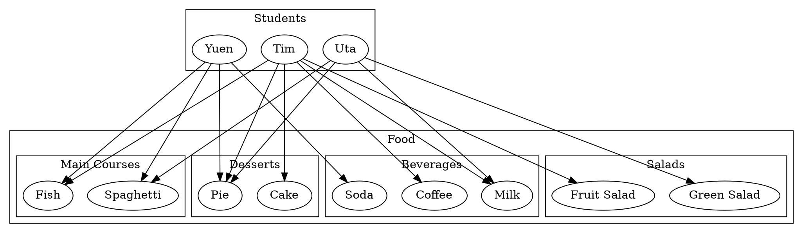

# 3.1

Note: For Section 3.1, problems 4ab and 7cd. These problems are different between the 4th edition and the 5th edition. This time, please use the problems from the 4th edition. I also take a picture of these three problems in the 4th edition. So if you do not have the 4th edition, you can use this photo. But our lecture will still use the content of the 5th edition.

## 4

### a

### b

## 7

### c

### d

## 12

Find counterexamples to show that the statement is false

$\forall$ real numbers $x$ and $y$, $\sqrt{x+y}=\sqrt x+\sqrt y$.

## 17

Rewrite the following in the form “$\exists$ \_\_\_\_ $x$ such that \_\_\_\_.”

### b

Some real numbers are rational.

## 20

Rewrite the following statement informally in at least two different ways without using variables or the symbol $\forall$ or the words “for all.”

$\forall$ real numbers $x$, if $x$ is positive then the square root of $x$ is positive.

## 22

Rewrite the following in the form “$\forall$ \_\_\_\_ $x$, if \_\_\_\_ then \_\_\_\_.”

### a

All Java programs have at least 5 lines.

## 28

Rewrite each statement without using quantifiers or variables. Indicate which are true and which are false, and justify your answers as best as you can.

Let the domain of $x$ be the set $D$ of objects discussed in mathematics courses, and let $\text{Real}(x)$ be “$x$ is a real number,” $\text{Pos}(x)$ be “$x$ is a positive real number,” $\text{Neg}(x)$ be “$x$ is a negative real number,” and $\text{Int}(x)$ be “$x$ is an integer.”

### a

$\text{Pos}(0)$

### b

$\forall x,\text{Real}(x)\land \text{Neg}(x)\to \text{Pos}(-x)$

# 3.2

## 1

Which of the following is a negation for “All discrete mathematics students are athletic”? More than one answer may be correct.

1. There is a discrete mathematics student who is nonathletic.
2. All discrete mathematics students are nonathletic.
3. There is an athletic person who is not a discrete mathematics student.
4. No discrete mathematics students are athletic.
5. Some discrete mathematics students are nonathletic.
6. No athletic people are discrete mathematics students.

## 5

Write a negation for each of the following statements.

### a

Every valid argument has a true conclusion.

### b

All real numbers are positive, negative, or zero.

## 12

Determine whether the proposed negation is correct. If it is not, write a correct negation.

*Statement*: The product of any irrational number and any rational number is irrational.

*Proposed negation*: The product of any irrational number and any rational number is rational.

## 17

Write a negation for each statement

$\forall$ integers $d$, if $\frac{6}{d}$ is an integer, then $d=3$

## 29

Write the contrapositive, converse, and inverse. Indicate as best as you can which of these statements are true and which are false. Give a counterexample for each that is false.

$\forall n\in Z$, if $n$ is prime then $n$ is odd or $n=2$.

## 48

Use the facts that the negation of a $\forall$ statement is a $\exists$ statement and that the negation of an if-then statement is an and statement to rewrite the statement without using the word necessary or sufficient.

Being a polynomial is not a sufficient condition for a function to have a real root.

# 3.3

## 2

Let $G(x, y)$ be “$x^2>y$” Indicate which of the following statements are true and which are false.

### a

$G(2,3)$

### b

$G(1,1)$

### c

$G\left( \frac{1}{2}, \frac{1}{2} \right)$

### d

$G(-2,2)$

## 10

Determine whether each of the following statements is true or false.

### a

$\forall$ student $S$, $\exists$ a dessert $D$ such that $S$ chose $D$.

### b

$\forall$ student $S$, $\exists$ a salad $T$ such that $S$ chose $T$.

## 19

Rewrite the statement in English without using the symbol $\forall$ or $\exists$ or variables and expressing your answer as simply as possible. Also, write a negation for the statement.

$\exists x\in\mathbf R$ such that for every real number $y$,
$x+y=0$

## 23

Rewrite the statement in English without using the symbol $\forall$ or $\exists$ or variables. Also, indicate whether the statement is true or false.

### a

$\forall$ nonzero real number $r$, $\exists$ a real number $s$ such that $rs=1$.

### b

$\exists$ a real number $r$ such that $\forall$ nonzero real
number $s$, $rs 1.

# 3.4

## 2

## 14

## 22

## 24

# 4.1

## 9

## 11

## 25
