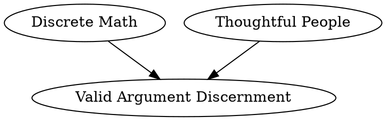
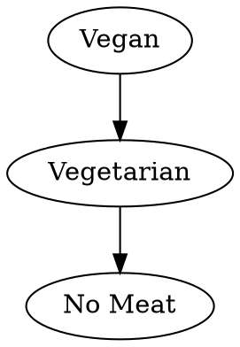

```dot
digraph {
	A [label="Discrete Math"]
	B [label="Valid Argument Discernment"]
	C [label="Thoughtful People"]
	A -> B
	C -> B
}
```

^22

```dot
digraph {
	A [label="Vegetarian"]
	B [label="No Meat"]
	C [label="Vegan"]
	A -> B
	C -> A
}
```
