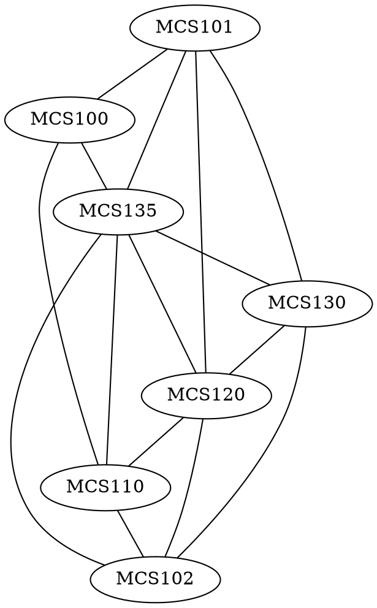

# 9.4

## 4

In a group of $700$ people, must there be $2$ who have the same first and last initials? Why?

> [!answer]
> Yes, if there are $26$ letters, there are $26^2$ combinations of two letters.
> 
> $26^2<700$ so there must at least be two with the same initials in a group of $700$ people due to the pigeonhole principle.

## 7

Let $S=\{3, 4, 5, 6, 7, 8, 9, 10, 11, 12\}$. Suppose six integers are chosen from $S$. Must there be two integers whose sum is $15$? Why?

> [!answer]
> Yes, if we separate the original set into multiple sets with sums of 15, there would be 5 sets of sums of 15. Since we are choosing 6 integers, and there are only 5 sets, one set must have both integers selected. Therefore, there must be a sum of 15 at least once.

## 11

If $n+1$ integers are chosen from the set $\{1, 2, 3,..., 2n\}$, where $n$ is a positive integer, must at least one of them be even? Why?

> [!answer]
> In that set, there are only $n$ odd numbers, we are choosing more then $n$ integers from the list, so at least one integer must be non-odd (or even) by the pigeonhole principle.

## 31

A group of $15$ executives are to share $5$ assistants. Each executive is assigned exactly $1$ assistant, and no assistant is assigned to more than $4$ executives. Show that at least $3$ assistants are assigned to $3$ or more executives.

> [!answer]
> If the assistants were evenly distributed across all executives, then there would be 5 assistants with 3 executives, if they were as unevenly distributed as possible, then there would be 3 assistants with 4 executives and 1 assistant with 2 executives and 1 assistant with 1 executive. By our upper and lower bounds, there must always be at least 3 assistants assigned to 3 or more executives.

## 33

Let $A$ be a set of six positive integers each of which is less than $15$. Show that there must be two distinct subsets of $A$ whose elements when added up give the same sum. (Thanks to Jonathan Goldstine for this problem.)

> [!answer]
> In a set of six integers below 15, the maximum variance of the sum of any subset with one or more elements will be equivalent to the sum of the 5 highest possible integers, which in this case is $60$. Including the $1$ possibility that the subset has $0$ size, there are at most $61$ possible sums of a subset of 6 integers below 15. Since there are $2^6=64$ possible subsets of a set of 6, there must be some subsets that have the same sum by the GPP.

# 9.5

## 7

A computer programming team has 13 members.

### a

How many ways can a group of seven be chosen to work on a project?

> [!answer]
> $13C7=1716$

### b

Suppose seven team members are women and six are men.

#### i

How many groups of seven can be chosen that contain four women and three men?

> [!answer]
> $7C4 \cdot 6C3=700$

#### ii

How many groups of seven can be chosen that contain at least one man?

> [!answer]
> $7C6\cdot6C1+7C5\cdot6C2+7C4\cdot6C3+7C3\cdot6C4+7C2\cdot6C5+7C1\cdot6C6=1715$

#### iii

How many groups of seven can be chosen that contain at most three women?

> [!answer]
> $7C3\cdot6C4+7C2\cdot6C5+7C1\cdot6C6=658$

### c

Suppose two team members refuse to work together on projects. How many groups of seven can be chosen to work on a project?

> [!answer]
> $13C7-11C5=1254$

### d

Suppose two team members insist on either working together or not at all on projects. How many groups of seven can be chosen to work on a project?

> [!answer]
> $11C7+11C5=792$

## 8

An instructor gives an exam with fourteen questions. Students are allowed to choose any ten to answer.

### a

How many different choices of ten questions are there?

> [!answer]
> $14C10=1001$

### b

Suppose six questions require proof and eight do not.

#### i

How many groups of ten questions contain four that require proof and six that do not?

> [!answer]
> $6C4\cdot8C6=420$

#### ii

How many groups of ten questions contain at least one that requires proof?

> [!answer]
> All of them by the GPP
> $1001$

#### iii

How many groups of ten questions contain at most three that require proof?

> [!answer]
> $8C8\cdot6C2+8C7\cdot6C3=175$

### c

Suppose the exam instructions specify that at most one of questions $1$ and $2$ may be included among the ten. How many different choices of ten questions are there?

> [!answer]
> $14C10-12C8=506$

### d

Suppose the exam instructions specify that either both questions $1$ and $2$ are to be included among the ten or neither is to be included. How many different choices of ten questions are there?

> [!answer]
> $12C10+12C8=581$

## 10

Two new drugs are to be tested using a group of $60$ laboratory mice, each tagged with a number for identification purposes. Drug $A$ is to be given to $22$ mice, drug $B$ is to be given to another $22$ mice, and the remaining $16$ mice are to be used as controls. How many ways can the assignment of treatments to mice be made? (A single assignment involves specifying the treatment for each mouse—whether drug $A$, drug $B$, or no drug.)

> [!answer]
> $60C22\cdot38C22=3.15\times10^{26}$

## 13

A coin is tossed ten times. In each case the outcome $H$ (for heads) or $T$ (for tails) is recorded. (One possible outcome of the ten tosses is denoted $T~H~H~T~T~T~H~T~T~H$.)

### b

In how many of the possible outcomes are exactly five heads obtained?

> [!answer]
> $10C5=252$

### e

In how many of the possible outcomes is at most one head obtained?

> [!answer]
> $11$ — via counting

## 16

Suppose that three microchips in a production run of forty are defective. A sample of five is to be selected to be checked for defects.

### b

How many samples will contain at least one defective chip?

> [!answer]
> $40C5-37C5=222111$

### c

What is the probability that a randomly chosen sample of five contains at least one defective chip?

> [!answer]
> $\frac{222111}{658008}=33.8\%$

## 20

### a

How many distinguishable ways can the letters of the word $MILLIMICRON$ be arranged in order?

> [!answer]
> $2M$
> $3I$
> $2L$
> $1C$
> $1R$
> $1O$
> $1N$
> 
> $\frac{11P11}{2\cdot 3\cdot 2}=3326400$

### b

How many distinguishable orderings of the letters of $MILLIMICRON$ begin with $M$ and end with $N$?

> [!answer]
> $1M$
> $3I$
> $2L$
> $1C$
> $1R$
> $1O$
> 
> $\frac{9P9}{3\cdot 2}=60480$

### c

How many distinguishable orderings of the letters of $MILLIMICRON$ contain the letters $CR$ next to each other in order and also the letters $ON$ next to each other in order?

> [!answer]
> $2M$
> $3I$
> $2L$
> $1CR$
> $1ON$
> 
> $\frac{9P9}{2\cdot 3\cdot 2}=30240$

# 9.8

## 3

Suppose $A$ and $B$ are mutually exclusive events in a sample space $S$, $C$ is another event in $S$, $A\cup B\cup C=S$, and $A$ and $B$ have probabilities $0.4$ and $0.2$, respectively.

### a

What is $P(A\cup B)?$

> [!answer]
> $0.6$

### b

Is it possible that $P(C)=0.22$? Explain.

> [!answer]
> No, because then the maximum $P(A\cup B\cup C)$ could be would be $0.82$, which is not $1$. $P(C)$ must be at least $0.4$ in order for the defintion of $A\cup B \cup C=S$ to be true as $P(S)=1$

## 15

A company offers a raffle whose grand prize is a $40,000 new car. Additional prizes are a $1,000 television and a $500 computer. Tickets cost $20 each. Ticket income over the cost of the prizes will be donated to charity. If 3,000 tickets are sold, what is the expected gain or loss of each ticket?

> [!answer]
> $\frac{40000+1000+500}{3000}-20=-6.167$

## 18

An urn contains five balls numbered $1, 2, 2, 8,  8$. If a person selects a set of three balls at random, what is the expected value of the sum of the numbers on the balls?

> [!answer]
>$3\cdot \frac{1+2+2+8+8}{5}=12.6$ 

# 9.9

## 2

Suppose $P(A|B)=\frac{1}{2}$ and $P(A\cap B)=\frac{1}{6}$. What is $P(B)$?

> [!answer]
> $P(A|B)= \frac{P(A\cap B)}{P(B)}$
> $P(B)=\frac{1}{3}$

## 18

Prove that if:
- $P(A\cap B)=P(A)\cdot P(B)$
- $P(A)\ne0$
- $P(B)\ne0$
Then:
- $P(A|B)=P(A)$
- $P(B|A)=P(B)$

> [!answer]
> $P(A\cap B)=P(A)\cdot P(B)$
> $P(A|B)=\frac{P(A\cap B)}{P(B)}=P(A)$
> $P(B|A)=\frac{P(A\cap B)}{P(A)}=P(B)$

# Additional

## 1

One blue die and one gray die are rolled, what is the probability that the sum of the numbers is 6, given that both of the numbers are odd?

> [!answer]
> $B\in\{1,3,5\}$
> $G\in\{1,3,5\}$
> $\frac{3}{9}=\frac{1}{3}$

## 2

Imagine there is a drug test that is 98% accurate, meaning that 98% of the time, it shows a true positive result for someone using the drug, and 98% of the time, it shows a true negative result for nonusers of the drug. Next, assume 0.5% of people use the drug. If a person selected at random tests positive for the drug, what is the probability the person is actually a user of the drug?

> [!answer]
> This definition of test accuracy is inaccurate. An accuracy of 98% only means it is correct 98% of the time overall, not that it "shows a true positive result for someone using the drug, and 98% of the time, it shows a true negative result for nonusers of the drug". The two individual accuracies need not be equal. I will use this incorrect definition of the term for this question as it is unsolvable otherwise.
> 
> $P(AP)=0.5\%$
> $P(PT|AP)=98\%$
> $P(NT|AN)=98\%$
> 
> $P(TP)=P(TP|AP)P(AP)=0.49\%$
> 
> $P(AP|PT)=\frac{P(PT|AP)P(AP)}{P(PT)}$
> $\frac{P(PT|AP)P(AP)}{P(PT|AP)P(AP)+P(PT|AN)P(AN)}=\frac{0.98\cdot0.005}{0.98\cdot0.005+0.02\cdot0.995}=19.76\%$

# 1.4

## 5

Show that the two drawings represent the same graph by labeling the vertices and edges of the right-hand drawing to correspond to those of the left-hand drawing.

![[CSDS 302 - Discrete Math/HW/8/1.4/5.svg|500]]

> [!answer]
> ![[CSDS 302 - Discrete Math/HW/8/1.4/5a.svg]]

## 8

![[8.svg|500]]

### i

Find all edges that are incident on $v_1$.

> [!answer]
> $e_1,e_2,e_3$

### ii

Find all vertices that are adjacent to $v_3$.

> [!answer]
> $v_2,v_3,v_1$

### iii

Find all edges that are adjacent to $e_1$.

> [!answer]
> $e_2,e_3,e_8,e_9$

### iv

Find all loops.

> [!answer]
> $e_7,e_6$

### v

Find all parallel edges.

> [!answer]
> $e_8,e_9$
> $e_4,e_5$

### vi

Find all isolated vertices.

> [!answer]
> $v_6$

### vii

Find the degree of $v_3$.

> [!answer]
> $5$

## 14

Two jugs $A$ and $B$ have capacities of $3$ quarts and $5$ quarts, respectively. Can you use the jugs to measure out exactly $1$ quart of water, while obeying the following restrictions?

- You may fill either jug to capacity from a water tap
- You may empty the contents of either jug into a drain
- You may pour water from either jug into the other.

> [!answer]
> 1. Fill the 3 quart jug
> 2. Dump it into the 5 quart jug
> 3. Fill the 3 quart jug
> 4. Fill the 5 quart jug with the 3 quart jug
> 5. There will be 1 quart left in the 3 quart jug

## 17 

A department wants to schedule final exams so that no student has more than one exam on any given day. The vertices of the graph below show the courses that are being taken by more than one student, with an edge connecting two vertices if there is a student in both courses. Find a way to color the vertices of the graph with only four colors so that no two adjacent vertices have the same color and explain how to use the result to schedule the final exams.

> [!answer]
> ![[CSDS 302 - Discrete Math/HW/8/1.4/Tables#^17|Tables]]

# 10.1

## 2

In the graph below, determine whether the following walks are trails, paths, closed walks, circuits, simple circuits, or just walks.

![[CSDS 302 - Discrete Math/HW/8/10.1/2.svg|500]]

### a

$v_1e_2v_2e_3v_3e_4v_4e_5v_2e_2v_1e_1v_0$

> [!answer]
> Walk

### d

$v_2v_1v_5v_2v_3v_4v_2$

> [!answer]
> Circuit

## 6

An edge whose removal disconnects the graph of which it is a part is called a bridge. Find all **bridges** for each of the graphs.

### b

![[6b.svg|500]]

> [!answer]
> $1-2$
> $3-4$
> $8-7$

### c

![[6c.svg|500]]

> [!answer]
> $2-3$
> $6-7$
> $7-8$
> $9-10$

## 7

Given any positive integer $n$

### a

Find a connected graph with $n$ edges such that removal of just one edge disconnects the graph

> [!answer]
> A Line, where each subsequent vertex is added to only touch the previous vertex.
> $1-2-3-4-5-6-...-n$

### b

Find a connected graph with $n$ edges that cannot be disconnected by the removal of any single edge.

> [!answer]
> A graph where every vertex has an edge to every other vertex

## 8

Find the number of connected components for each of the following graphs.

### b

![[8b.svg|500]]

> [!answer]
> $1:6$

### c

![[8c.svg|500]]

> [!answer]
> $2:8,2$

## 9

Both of (b)–(c) describes a graph. In each case answer yes, no, or not necessarily to this question:
Does the graph have an Euler circuit? Justify your answers.

### b

$G$ is a connected graph with five vertices of degrees $2, 2, 4, 4, 6$.

> [!answer]
> Yes, all the degrees are even, so there is an Euler circuit.

### c

$G$ is a graph with five vertices of degrees $2, 2, 4, 4, 6$.

> [!answer]
> Not necessarily. If connected, then yes, if not then no.

## 13

Determine if the graph has euler circuits. If the graph does not have an euler circuit, explain why not. If it does have an euler circuit, describe one.

![[13.svg|500]]

> [!answer]
> There are nodes with odd degrees, so an Euler circuit is impossible

## 20

Determine whether there is an euler trial from $u$ to $w$. If there is, find such a trail.

![[20.svg|500]]

> [!answer]
> No, it is not possible as there are more than two odd degree vertices.

## 22

The following is a floor plan of a house. Is it possible to enter the house in room $A$, travel through every interior doorway of the house exactly once, and exit out of room $E$? If so, how can this be done?

![[22.svg|500]]

> [!answer]
> Yes, $A,H,G,B,C,D,G,F,E$

## 26

Suppose that in a group of five people $A, B, C, D, E$ the following pairs of people are acquainted with each other.
$A$ and $C$, $A$ and $D$, $B$ and $C$, $C$ and $D$, $C$ and $E$.

### a

Draw a graph to represent this situation.

> [!answer]
> ![[CSDS 302 - Discrete Math/HW/8/10.1/Tables#^26a|Tables]]

### b

Draw a graph that illustrates who among these five people are not acquainted. That is, draw an edge between two people if, and only if, they are not acquainted.

> [!answer]
> ![[CSDS 302 - Discrete Math/HW/8/10.1/Tables#^26b|Tables]]

## 29

Find Hamiltonian circuits

![[29.svg|500]]

> [!answer]
> $0,1,2,3,4,5,6,7,0$
> $0,7,1,2,3,4,5,6,0$
> $0,1,3,4,5,2,6,7,0$
> $0,7,1,3,4,5,2,6,0$
> And all reverses

# 10.2

## 2

Find the adjacency matrix for the following directed graph.

### b

![[CSDS 302 - Discrete Math/HW/8/10.2/2b.svg|500]]

> [!answer]
> $\begin{bmatrix}1&0&1&0\\0&0&1&0\\1&0&0&1\\0&0&0&1\end{bmatrix}$

## 3

Find a directed graph that has the following adjacency matrix

### b

$\begin{bmatrix}0&1&0&0\\2&0&1&0\\1&2&1&0\\0&0&1&0\end{bmatrix}$

> [!answer]
> ![[CSDS 302 - Discrete Math/HW/8/10.2/Tables#^3b|Tables]]

## 4

Find adjacency matrices for the following (undirected) graphs.

### b

![[4b.svg|500]]

> [!answer]
> $\begin{bmatrix}1&0&0&0\\0&1&1&2\\0&1&1&0\\0&2&0&0\end{bmatrix}$

### d

$K_{2,3}$, the complete bipartite graph on $(2, 3)$ vertices

> [!answer]
> $\begin{bmatrix}0&0&1&1&1\\0&0&1&1&1\\1&1&0&0&0\\1&1&0&0&0\\1&1&0&0&0\end{bmatrix}$

## 19

$\mathbf A=\begin{bmatrix}1&1&2\\1&0&1\\2&1&0\end{bmatrix}$

### b

Let $G$ be the graph with vertices $v_1,v_2,v_3$ and with $\mathbf A$ as its adjacency matrix. Find the number of walks of length $2$ from $v_1$ to $v_3$ and the number of walks of length $3$ from $v_1$ to $v_3$. Do not draw $G$ to solve this problem.

> [!answer]
> $2:$
> $v_1,v_1,v_3$
> $v_1,v_2,v_3$
> $4:$
> $v_1,v_1,v_1,v_3$
> $v_1,v_2,v_1,v_3$
> $v_1,v_3,v_1,v_3$
> $v_1,v_3,v_2,v_3$

### c

Find five walks of length 2 from $v_3$ to $v_3$. Then draw $G$ and find the walks by visual inspection.

> [!answer]
> Via edges $(1,1),(1,2),(2,1),(2,2)$
> $v_3,v_1,v_3$
> $v_3,v_1,v_3$
> $v_3,v_1,v_3$
> $v_3,v_1,v_3$
> 
> $v_3,v_2,v_3$

## 22

### a

Draw a graph that has

$\begin{bmatrix}0&0&0&1&2\\0&0&0&1&1\\0&0&0&2&1\\1&1&2&0&0\\2&1&1&0&0\end{bmatrix}$

as its adjacency matrix. Is this graph bipartite?

> [!answer]
> ![[CSDS 302 - Discrete Math/HW/8/10.2/Tables#^62c7cc|Tables]]
> Yes, on $(A,B,C),(D,E)$
