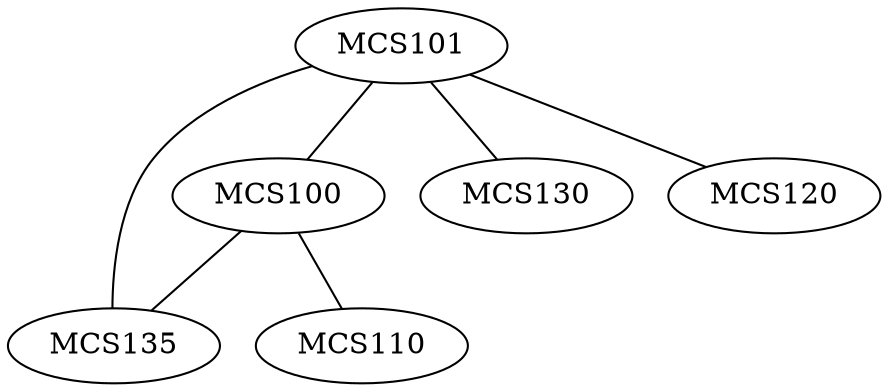

# 1.4

## 5

## 8

## 14

Two jugs $A$ and $B$ have capacities of $3$ quarts and $5$ quarts, respectively. Can you use the jugs to measure out exactly $1$ quart of water, while obeying the following restrictions?
- You may fill either jug to capacity from a water tap
- You may empty the contents of either jug into a drain
- You may pour water from either jug into the other.

## 17 

A department wants to schedule final exams so that no student has more than one exam on any given day. The vertices of the graph below show the courses that are being taken by more than one student, with an edge connecting two vertices if there is a student in both courses. Find a way to color the vertices of the graph with only four colors so that no two adjacent vertices have the same color and explain how to use the result to schedule the final exams.

# 10.1

## 2

### a

### d

## 6

### b

### c

## 7

## 8

### b

### c

## 9

### b

### c

## 13

## 20

## 22

## 26

## 29

# 10.2

## 2

### b

## 3

### b

## 4

### b

### d

## 19

### b

### c

## 22

### a
