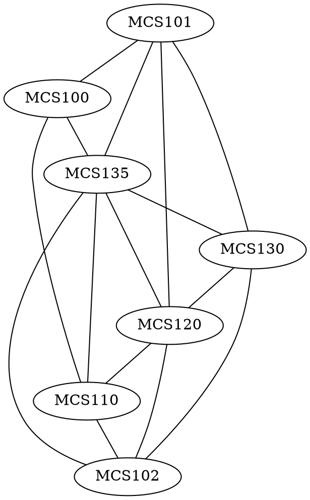

# 1.4

## 5

Show that the two drawings represent the same graph by labeling the vertices and edges of the right-hand drawing to correspond to those of the left-hand drawing.

![[5.svg|500]]

## 8

![[8.svg|500]]

### i

Find all edges that are incident on $v_1$.

### ii

Find all vertices that are adjacent to $v_3$.

### iii

Find all edges that are adjacent to $e_1$.

### iv

Find all loops.

### v

Find all parallel edges.

### vi

Find all isolated vertices.

### vii

Find the degree of $v_3$.

## 14

Two jugs $A$ and $B$ have capacities of $3$ quarts and $5$ quarts, respectively. Can you use the jugs to measure out exactly $1$ quart of water, while obeying the following restrictions?
- You may fill either jug to capacity from a water tap
- You may empty the contents of either jug into a drain
- You may pour water from either jug into the other.

## 17 

A department wants to schedule final exams so that no student has more than one exam on any given day. The vertices of the graph below show the courses that are being taken by more than one student, with an edge connecting two vertices if there is a student in both courses. Find a way to color the vertices of the graph with only four colors so that no two adjacent vertices have the same color and explain how to use the result to schedule the final exams.

# 10.1

## 2

In the graph below, determine whether the following walks are trails, paths, closed walks, circuits, simple circuits, or just walks.

![[2.svg|500]]

### a

$v_1e_2v_2e_3v_3e_4v_4e_5v_2e_2v_1e_1v_0$

### d

$v_2v_1v_5v_2v_3v_4v_2$

## 6

An edge whose removal disconnects the graph of which it is a part is called a bridge. Find all **bridges** for each of the graphs.

### b

![[6b.svg|500]]

### c

![[6c.svg|500]]

## 7

Given any positive integer $n$

### a

Find a connected graph with $n$ edges such that removal of just one edge disconnects the graph

### b

Find a connected graph with $n$ edges that cannot be disconnected by the removal of any single edge.

## 8

Find the number of connected components for each of the following graphs.

### b

![[8b.svg|500]]

### c

![[8c.svg|500]]

## 9

Both of (b)–(c) describes a graph. In each case answer yes, no, or not necessarily to this question:
Does the graph have an Euler circuit? Justify your answers.

### b

$G$ is a connected graph with five vertices of degrees $2, 2, 4, 4, 6$.

### c

$G$ is a graph with five vertices of degrees $2, 2, 4, 4, 6$.

## 13

Determine if the graph has euler circuits. If the graph does not have an euler circuit, explain why not. If it does have an euler circuit, describe one.

![[13.svg|500]]

## 20

Determine whether there is an euler trial from $u$ to $w$. If there is, find such a trail.

![[20.svg|500]]

## 22

The following is a floor plan of a house. Is it possible to enter the house in room $A$, travel through every interior doorway of the house exactly once, and exit out of room $E$? If so, how can this be done?

![[22.svg|500]]

## 26

Suppose that in a group of five people $A, B, C, D, E$ the following pairs of people are acquainted with each other.
$A$ and $C$, $A$ and $D$, $B$ and $C$, $C$ and $D$, $C$ and $E$.

### a

Draw a graph to represent this situation.

### b

Draw a graph that illustrates who among these five people are not acquainted. That is, draw an edge between two people if, and only if, they are not acquainted.

## 29

Find Hamiltonian circuits

![[29.svg|500]]

# 10.2

## 2

### b

## 3

### b

## 4

### b

### d

## 19

### b

### c

## 22

### a
