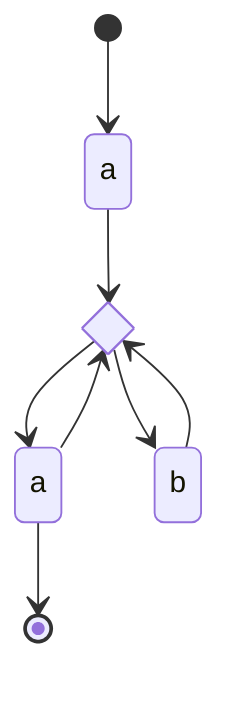
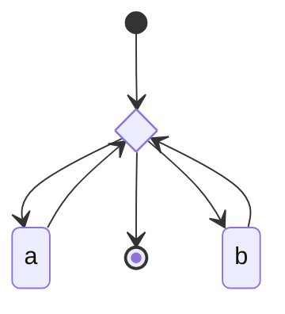
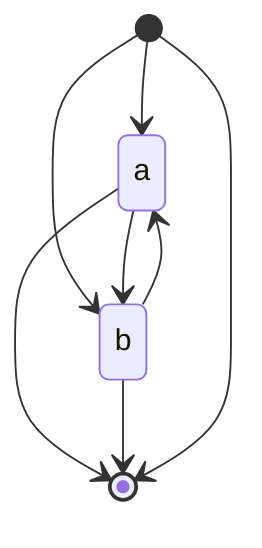
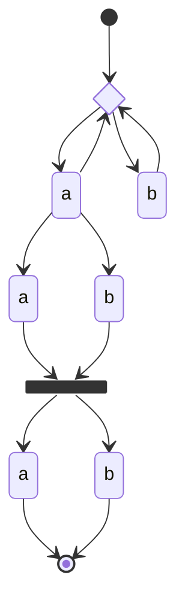
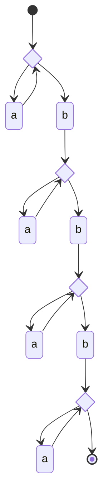
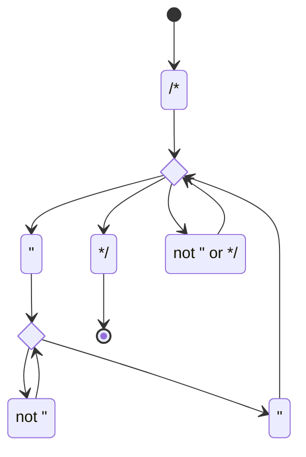
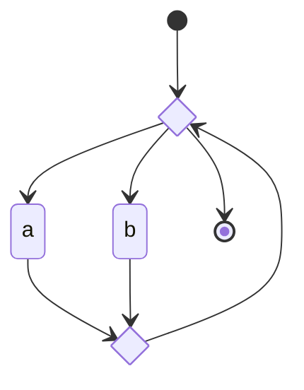
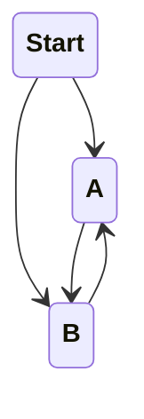

^a

^b

^c

^d

^c2

| State | Description     | $\epsilon$  | $"$         | $*/$        | $/*$        | $other$     |
| ----- | --------------- | ----------- | ----------- | ----------- | ----------- | ----------- |
| Start | Start           | $\emptyset$ | $\emptyset$ | $\{0\}$     | $\emptyset$ | $\emptyset$ |
| 0     | `/*`            | $\{1\}$     | $\emptyset$ | $\emptyset$ | $\emptyset$ | $\emptyset$ |
| 1     | Loop Point      | $\emptyset$ | $\{2\}$     | $\{3\}$     | $\{4\}$     | $\{4\}$     |
| 2     | `"`             | $\{5\}$     | $\emptyset$ | $\emptyset$ | $\emptyset$ | $\emptyset$ |
| 3     | `*/`            | $\{End\}$   | $\emptyset$ | $\emptyset$ | $\emptyset$ | $\emptyset$ |
| 4     | Not `"` or `*/` | $\{4\}$     | $\emptyset$ | $\emptyset$ | $\emptyset$ | $\emptyset$ |
| 5     | Loop Point      | $\emptyset$ | $\{7\}$     | $\{6\}$     | $\{6\}$     | $\{6\}$     |
| 6     | Not `"`         | $\{5\}$     | $\emptyset$ | $\emptyset$ | $\emptyset$ | $\emptyset$ |
| 7     | `"`             | $\{1\}$     | $\emptyset$ | $\emptyset$ | $\emptyset$ | $\emptyset$ |
| End   | End             | $\emptyset$ | $\emptyset$ | $\emptyset$ | $\emptyset$ | $\emptyset$ |
^362

^b2

| State | Description | $\epsilon$  | $a$         | $b$         |
| ----- | ----------- | ----------- | ----------- | ----------- |
| Start | Start       | $\{0\}$     | $\emptyset$ | $\emptyset$ |
| 0     | Loop Start  | $\{End\}$   | $\{1\}$     | $\{2\}$     |
| 1     | `a`         | $\{3\}$     | $\emptyset$ | $\emptyset$ |
| 2     | `b`         | $\{3\}$     | $\emptyset$ | $\emptyset$ |
| 3     | Loop End    | $\{0\}$     | $\emptyset$ | $\emptyset$ |
| End   | End         | $\emptyset$ | $\emptyset$ | $\emptyset$ |
^b3

| NFA State           | DFA State | $a$ | $b$ | End |
| ------------------- | --------- | --- | --- | --- |
| $\{Start, 0, End\}$ | $\alpha$  | A   | B   | Yes |
| $\{1, 3, 0, End\}$  | A         | A   | B   | Yes |
| $\{2, 3, 0, End\}$  | B         | A   | B   | Yes |
^b4

| State | $a$ | $b$ | End |
| ----- | --- | --- | --- |
| Start | A   | B   | Yes |
| A     | A   | B   | Yes |
| B     | A   | B   | Yes |
^b5

^b6
