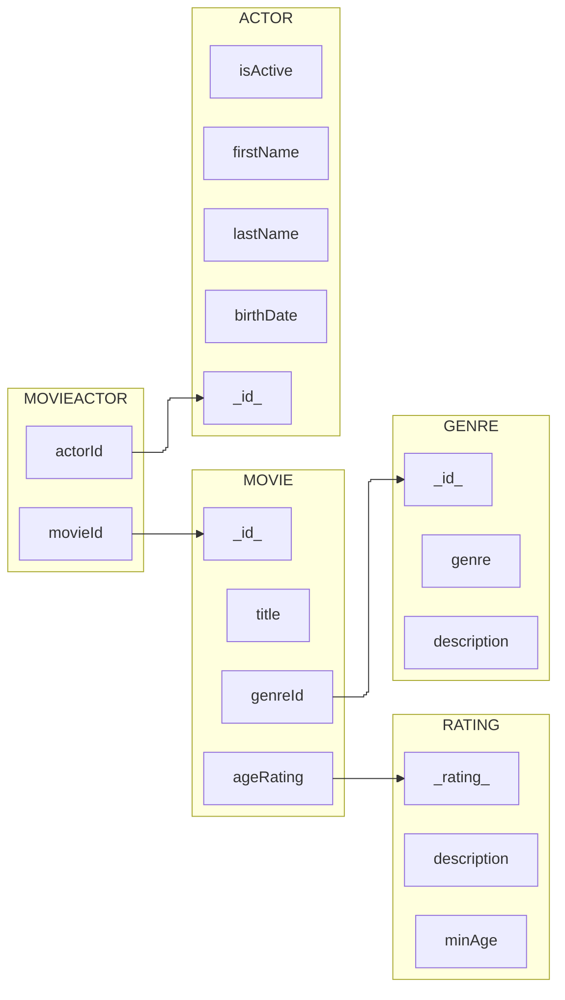
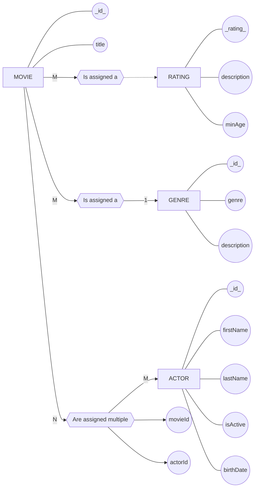
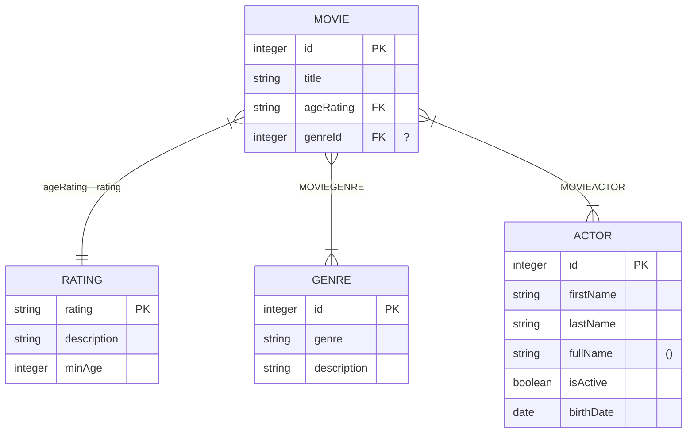
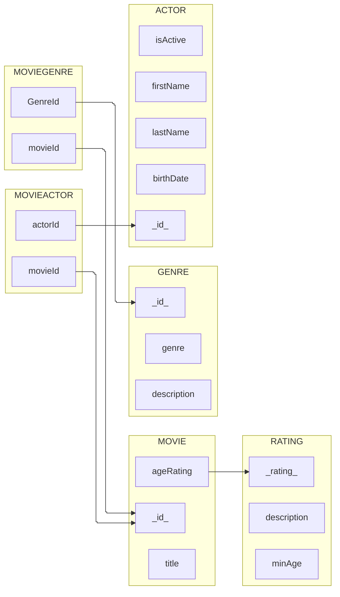
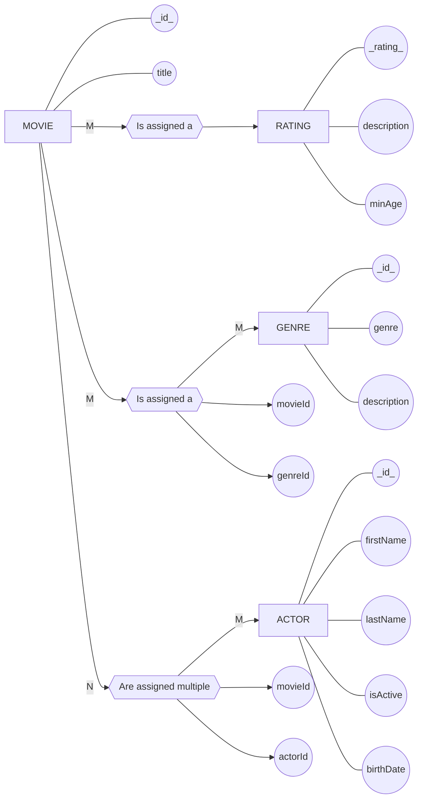

| $CK$         | $SK$         | $K$ | $\to$     |
| ------------ | ------------ | --- | --------- |
|              |              | A   | A         |
|              |              | B   | A,B       |
| $\checkmark$ | $\checkmark$ | C   | A,B,C,D,E |
|              |              | D   | D         |
|              |              | E   | D,E       |
|              |              | AB  | A,B       |
|              | $\checkmark$ | AC  | A,B,C,D,E |
|              |              | AD  | A,D       |
|              | $\checkmark$ | AE  | A,B,C,D,E |
|              | $\checkmark$ | BD  | A,B,C,D,E |
|              | $\checkmark$ | BE  | A,B,C,D,E |
|              |              | DE  | D,E       |
|              | $\checkmark$ | ABD | A,B,C,D,E |
|              | $\checkmark$ | ABE | A,B,C,D,E |
|              | $\checkmark$ | BDE | A,B,C,D,E |
^1


^2c


^2b


^2d

```col-md

| MOVIES |       |           |         |
| ------ | ----- | --------- | ------- |
| id     | title | ageRating | genreId |
| 1      | Lost  | G         | 1       |
| 2      | Found | R         | 2       |


| RATING |             |        |
| ------ | ----------- | ------ |
| rating | description | minAge |
| G      | General     | 0      |
| R      | Restricted  | 18     |


| GENRE |        |                 |
| ----- | ------ | --------------- |
| id    | genre  | description     |
| 1     | rom    | Romance         |
| 2     | sci-fi | Science Fiction |


| ACTOR |           |          |          |            |
| ----- | --------- | -------- | -------- | ---------- |
| id    | firstName | lastName | isActive | birthDate  |
| 1     | John      | Doe      | true     | 1950-01-01 |
| 2     | Johnny    | Dohe     | true     | 1953-03-01 |
| 3     | Jon       | Do       | true     | 1959-02-01 |
| 4     | Jhon      | Dhoe     | false    | 1955-08-01 |
| 5     | Joe       | Dohn     | true     | 1952-04-01 |
| 6     | Joey      | Doey     | true     | 1957-01-01 |


| MOVIEACTOR |         |
| ---------- | ------- |
| movieId    | actorId |
| 1          | 1       |
| 1          | 2       |
| 1          | 3       |
| 2          | 2       |
| 2          | 4       |
| 2          | 5       |
```
^2e


^2f


^2g


^2h

```col-md

| MOVIES |       |           |
| ------ | ----- | --------- |
| id     | title | ageRating |
| 1      | Lost  | G         |
| 2      | Found | R         |


| RATING |             |        |
| ------ | ----------- | ------ |
| rating | description | minAge |
| G      | General     | 0      |
| R      | Restricted  | 18     |


| GENRE |        |                 |
| ----- | ------ | --------------- |
| id    | genre  | description     |
| 1     | rom    | Romance         |
| 2     | sci-fi | Science Fiction |


| ACTOR |           |          |          |            |
| ----- | --------- | -------- | -------- | ---------- |
| id    | firstName | lastName | isActive | birthDate  |
| 1     | John      | Doe      | true     | 1950-01-01 |
| 2     | Johnny    | Dohe     | true     | 1953-03-01 |
| 3     | Jon       | Do       | true     | 1959-02-01 |
| 4     | Jhon      | Dhoe     | false    | 1955-08-01 |
| 5     | Joe       | Dohn     | true     | 1952-04-01 |


| MOVIEACTOR |         |
| ---------- | ------- |
| movieId    | actorId |
| 1          | 1       |
| 1          | 2       |
| 1          | 3       |
| 2          | 2       |
| 2          | 4       |
| 2          | 5       |


| MOVIEGENRE |         |
| ---------- | ------- |
| movieId    | actorId |
| 1          | 1       |
| 1          | 2       |
| 2          | 2       |

```
^2i
