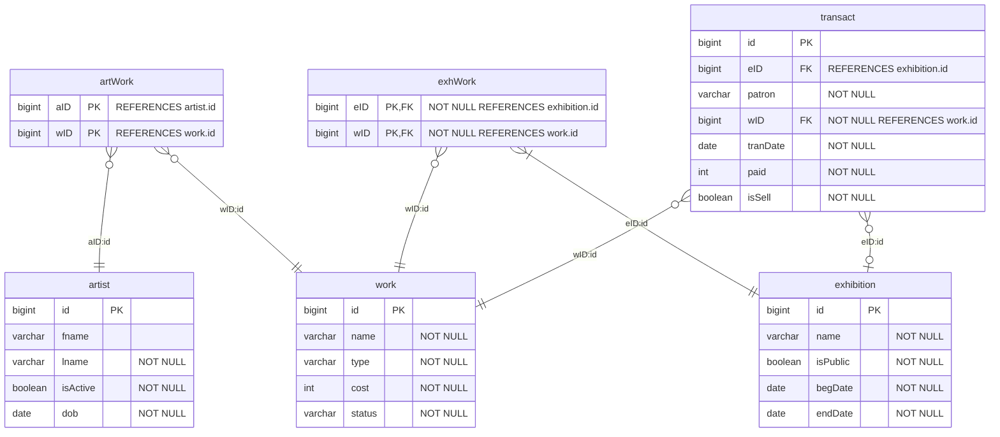

^1a

```SQL
-----------------
-- QUESTION 1b --
-----------------
CREATE DATABASE ArtisticCreations;

GO
;
```
^1b

```SQL
-----------------
-- QUESTION 1c --
-----------------
USE ArtisticCreations;

GO
;

CREATE TABLE artist (
    id bigint IDENTITY(4000, 1),
    fname varchar(255),
    lname varchar(255) NOT NULL,
    isActive bit NOT NULL,
    dob date NOT NULL,
    PRIMARY KEY (id)
);

CREATE TABLE works (
    id bigint IDENTITY(1500, 1),
    title varchar(255) NOT NULL,
    category varchar(10) NOT NULL,
    cost bigint NOT NULL,
    currentStatus varchar(10) NOT NULL,
    CHECK (category IN ('paint', 'sculpt', 'photo', 'draw')),
    CHECK (currentStatus IN ('avail', 'pend', 'sold')),
    PRIMARY KEY (id)
);

CREATE TABLE artWork (
    aId bigint NOT NULL,
    wId bigint NOT NULL,
    FOREIGN KEY (aId) REFERENCES artist(id),
    FOREIGN KEY (wId) REFERENCES works(id),
    PRIMARY KEY (aId, wId)
);

CREATE TABLE exhibition (
    id bigint IDENTITY(1, 1),
    title varchar(255) NOT NULL,
    isPublic bit NOT NULL,
    begDate date NOT NULL,
    endDate date NOT NULL,
    CHECK (endDate >= begDate),
    PRIMARY KEY (id)
);

CREATE TABLE exhWork (
    eId bigint NOT NULL,
    wId bigint NOT NULL,
    FOREIGN KEY (eId) REFERENCES exhibition(id),
    FOREIGN KEY (wId) REFERENCES works(id),
    PRIMARY KEY (eId, wId)
);

CREATE TABLE transact (
    id bigint IDENTITY(1, 1),
    eId bigint,
    patron varchar(255) NOT NULL,
    wId bigint NOT NULL,
    transDate date NOT NULL,
    paid int NOT NULL,
    isSell bit NOT NULL,
    FOREIGN KEY (eId) REFERENCES exhibition(id),
    FOREIGN KEY (wId) REFERENCES works(id),
    PRIMARY KEY (id)
);

GO
;
```
^1c

```SQL
-----------------
-- QUESTION 1d --
-----------------
USE ArtisticCreations;

GO
;

INSERT INTO
    artist (fname, lname, isActive, dob)
VALUES
    ('John', 'Doe', 1, '1990-05-15'),
    ('Jane', 'Smith', 1, '1985-12-07'),
    ('Bob', 'Johnson', 0, '1995-01-20'),
    ('Alice', 'Williams', 1, '1992-09-10');

INSERT INTO
    artist (lname, isActive, dob)
VALUES
    ('Johnson', 1, '1980-03-12'),
    ('Smoth', 0, '1998-07-25');

INSERT INTO
    works (title, category, cost, currentStatus)
VALUES
    ('The River', 'photo', 250000, 'avail'),
    ('The Cat', 'paint', 500000, 'sold'),
    ('Pink Sunrise', 'sculpt', 300000, 'avail'),
    ('Butterfly.', 'draw', 2000000, 'pend'),
    ('b.', 'paint', 4000000, 'avail');

INSERT INTO
    artWork (aId, wId)
SELECT
    a.id,
    w.id
FROM
    artist AS a,
    works AS w
WHERE
    a.lname = 'Smith'
    AND w.cost > 600000
    OR a.dob > '1990-01-01'
    AND w.category = 'paint'
    OR a.lname = 'Johnson'
    AND a.fname IS NULL
    AND w.currentStatus = 'pend'
    OR a.lname = 'Smoth'
    AND w.category = 'photo';

INSERT INTO
    exhibition (title, isPublic, begDate, endDate)
VALUES
    (
        'Light and Shadow',
        0,
        '2015-05-05',
        '2015-05-06'
    ),
    (
        'The Future',
        0,
        '2017-01-01',
        '2017-01-08'
    ),
    ('blu', 1, '2018-02-15', '2018-02-17'),
    ('Space', 0, '2019-03-20', '2019-03-25'),
    ('The Sky', 1, '2021-04-01', '2021-04-07');

INSERT INTO
    exhWork (eId, wId)
SELECT
    e.id,
    w.id
FROM
    exhibition AS e,
    works AS w
WHERE
    e.title = 'Light and Shadow'
    AND w.category = 'paint'
    OR e.title = 'The Future'
    OR e.title = 'blu'
    AND w.category = 'sculpt'
    OR e.title = 'Space'
    AND w.currentStatus = 'pend'
    OR e.title = 'The Sky'
    AND w.category IN ('draw', 'paint');

INSERT INTO
    transact (eId, patron, wId, transDate, paid, isSell)
VALUES
    (
        NULL,
        'Alice',
        (
            SELECT
                id
            FROM
                works
            WHERE
                title = 'The Cat'
        ),
        '2015-05-05',
        500000,
        1
    ),
    (
        (
            SELECT
                id
            FROM
                exhibition
            WHERE
                title = 'The Future'
        ),
        'Bob',
        (
            SELECT
                id
            FROM
                works
            WHERE
                title = 'Pink Sunrise'
        ),
        '2017-01-05',
        300000,
        1
    ),
    (
        (
            SELECT
                id
            FROM
                exhibition
            WHERE
                title = 'The Future'
        ),
        'Bob',
        (
            SELECT
                id
            FROM
                works
            WHERE
                title = 'Pink Sunrise'
        ),
        '2017-01-06',
        -300000,
        0
    ),
    (
        (
            SELECT
                id
            FROM
                exhibition
            WHERE
                title = 'The Sky'
        ),
        'Tom',
        (
            SELECT
                id
            FROM
                works
            WHERE
                title = 'Butterfly.'
        ),
        '2021-04-07',
        2000000,
        1
    );

GO
;
```
^1d

```SQL
-----------------
-- QUESTION 1e --
-----------------
USE ArtisticCreations;

GO
;

SELECT
    title,
    category,
    cost,
    currentStatus
FROM
    works;

GO
;
```
^1e

```SQL
-----------------
-- QUESTION 1g --
-----------------
USE ArtisticCreations;

GO
;

SELECT
    id,
    TRIM(CONCAT(ISNULL(fname, ''), ' ', lname)) AS fullname
FROM
    artist
WHERE
    isActive = 1;

GO
;
```
^1g

```SQL
-----------------
-- QUESTION 1h --
-----------------
USE ArtisticCreations;

GO
;

SELECT
    fname,
    lname,
    dob
FROM
    artist
WHERE
    isActive = 1;

GO
;
```
^1h

```SQL
-----------------
-- QUESTION 1j --
-----------------
USE ArtisticCreations;

GO
;

SELECT
    category,
    AVG(cost) AS avgPrice
FROM
    works
GROUP BY
    category;

GO
;
```
^1j

```SQL
-----------------
-- QUESTION 1k --
-----------------
USE ArtisticCreations;

GO
;

SELECT
    a.lname,
    w.title AS artworkName,
    w.category
FROM
    artWork AS aw
    JOIN artist AS a ON aw.aId = a.id
    JOIN works AS w ON aw.wId = w.id;

GO
;
```
^1k

```SQL
-----------------
-- QUESTION 1m --
-----------------
USE ArtisticCreations;

GO
;

SELECT
    e.title,
    e.id,
    t.patron,
    t.paid,
    w.category
FROM
    transact AS t
    JOIN exhibition AS e ON t.eId = e.id
    JOIN works AS w ON t.wId = w.id
WHERE
    t.paid > (
        SELECT
            AVG(cost)
        FROM
            works
        WHERE
            currentStatus = 'sold'
    );

GO
;
```
^1m

```SQL
-----------------
-- QUESTION 1n --
-----------------
USE ArtisticCreations;

GO
;

ALTER TABLE
    transact DROP CONSTRAINT CHK_isSell;

ALTER TABLE
    transact DROP COLUMN isSell;

GO
;
```
^1n

```SQL
-----------------
-- QUESTION 1o --
-----------------
USE ArtisticCreations;

GO
;

ALTER TABLE
    artWork DROP COLUMN aId;

GO
;
```
^1o

```SQL
----------------
-- QUESTION 2 --
----------------
CREATE DATABASE University;

GO
;

USE University;

GO
;

CREATE TABLE classroom (
    building varchar(15),
    room_number varchar(7),
    capacity numeric(4, 0),
    PRIMARY KEY (building, room_number)
);

CREATE TABLE department (
    dept_name varchar(20),
    building varchar(15),
    budget numeric(12, 2) CHECK (budget > 0),
    PRIMARY KEY (dept_name)
);

CREATE TABLE course (
    course_id varchar(8),
    title varchar(50),
    dept_name varchar(20),
    credits numeric(2, 0) CHECK (credits > 0),
    PRIMARY KEY (course_id),
    FOREIGN KEY (dept_name) REFERENCES department ON DELETE
    SET
        NULL
);

CREATE TABLE instructor (
    ID varchar(5),
    name varchar(20) NOT NULL,
    dept_name varchar(20),
    salary numeric(8, 2) CHECK (salary > 29000),
    PRIMARY KEY (ID),
    FOREIGN KEY (dept_name) REFERENCES department ON DELETE
    SET
        NULL
);

CREATE TABLE section (
    course_id varchar(8),
    sec_id varchar(8),
    semester varchar(6) CHECK (
        semester IN ('Fall', 'Winter', 'Spring', 'Summer')
    ),
    year numeric(4, 0) CHECK (
        year > 1701
        AND year < 2100
    ),
    building varchar(15),
    room_number varchar(7),
    time_slot_id varchar(4),
    PRIMARY KEY (course_id, sec_id, semester, year),
    FOREIGN KEY (course_id) REFERENCES course ON DELETE CASCADE,
    FOREIGN KEY (building, room_number) REFERENCES classroom ON DELETE
    SET
        NULL
);

CREATE TABLE teaches (
    ID varchar(5),
    course_id varchar(8),
    sec_id varchar(8),
    semester varchar(6),
    year numeric(4, 0),
    PRIMARY KEY (ID, course_id, sec_id, semester, year),
    FOREIGN KEY (course_id, sec_id, semester, year) REFERENCES section ON DELETE CASCADE,
    FOREIGN KEY (ID) REFERENCES instructor ON DELETE CASCADE
);

CREATE TABLE student (
    ID varchar(5),
    name varchar(20) NOT NULL,
    dept_name varchar(20),
    tot_cred numeric(3, 0) CHECK (tot_cred >= 0),
    PRIMARY KEY (ID),
    FOREIGN KEY (dept_name) REFERENCES department ON DELETE
    SET
        NULL
);

CREATE TABLE takes (
    ID varchar(5),
    course_id varchar(8),
    sec_id varchar(8),
    semester varchar(6),
    year numeric(4, 0),
    grade varchar(2),
    PRIMARY KEY (ID, course_id, sec_id, semester, year),
    FOREIGN KEY (course_id, sec_id, semester, year) REFERENCES section ON DELETE CASCADE,
    FOREIGN KEY (ID) REFERENCES student ON DELETE CASCADE
);

CREATE TABLE advisor (
    s_ID varchar(5),
    i_ID varchar(5),
    PRIMARY KEY (s_ID),
    FOREIGN KEY (s_ID) REFERENCES student (ID) ON DELETE CASCADE,
    FOREIGN KEY (i_ID) REFERENCES instructor (ID) ON DELETE
    SET
        NULL
);

CREATE TABLE time_slot (
    time_slot_id varchar(4),
    day_of_week varchar(1),
    start_hr numeric(2) CHECK (
        start_hr >= 0
        AND start_hr < 24
    ),
    start_min numeric(2) CHECK (
        start_min >= 0
        AND start_min < 60
    ),
    end_hr numeric(2) CHECK (
        end_hr >= 0
        AND end_hr < 24
    ),
    end_min numeric(2) CHECK (
        end_min >= 0
        AND end_min < 60
    ),
    PRIMARY KEY (time_slot_id, day_of_week, start_hr, start_min)
);

CREATE TABLE prereq (
    course_id varchar(8),
    prereq_id varchar(8),
    PRIMARY KEY (course_id, prereq_id),
    FOREIGN KEY (course_id) REFERENCES course ON DELETE CASCADE,
    FOREIGN KEY (prereq_id) REFERENCES course
)
```
^2

```SQL
-----------------
-- QUESTION 2a --
-----------------
USE University;

GO
;

ALTER TABLE
    instructor
ADD
    salaryInt int CHECK (salaryInt > 2900000);

GO
;
```
^2a

```SQL
-----------------
-- QUESTION 2b --
-----------------
USE University;

GO
;

UPDATE
    instructor
SET
    salaryInt = CAST((salary * 100) AS int);

GO
;

ALTER TABLE
    instructor
ALTER COLUMN
    salaryInt int NOT NULL;

-- Check if the conversion is successful
SELECT
    salary,
    salaryInt
FROM
    instructor;

GO
;
```
^2b

```SQL
-----------------
-- QUESTION 2c --
-----------------
USE University;

GO
;

SELECT
    DISTINCT s.ID,
    s.name
FROM
    student AS s
    JOIN takes AS t ON s.ID = t.ID
    JOIN course AS c ON t.course_id = c.course_id
WHERE
    c.dept_name = 'Comp. Sci.';

GO
;
```
^2c

```SQL
-----------------
-- QUESTION 2d --
-----------------
USE University;

GO
;

SELECT
    DISTINCT s.ID,
    s.name
FROM
    student AS s
    LEFT JOIN takes AS t ON s.ID = t.ID
WHERE
    NOT t.year < 2009
    OR t.year IS NULL;

GO
;
```
^2d

```SQL
-----------------
-- QUESTION 2e --
-----------------
USE University;

GO
;

SELECT
    dept_name AS Department,
    MIN(salary) AS Minimum_Salary
FROM
    instructor
GROUP BY
    dept_name
ORDER BY
    Minimum_Salary ASC;

GO
;
```
^2e

```SQL
-----------------
-- QUESTION 2f --
-----------------
USE University;

GO
;

DELETE FROM
    prereq
WHERE
    course_id = 'CSDS-232';

DELETE FROM
    section
WHERE
    course_id = 'CSDS-232';

DELETE FROM
    teaches
WHERE
    course_id = 'CSDS-232';

DELETE FROM
    takes
WHERE
    course_id = 'CSDS-232';

DELETE FROM
    course
WHERE
    course_id = 'CSDS-232';

GO
;
```
^2f
