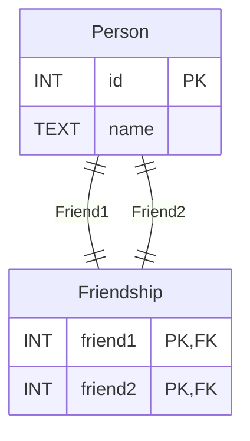

```SQL
CREATE TABLE student2 (
    ID              INT IDENTITY(1,1),
    name            VARCHAR(20) NOT NULL,
    dept_name       VARCHAR(20),
    tot_cred        NUMERIC(3,0) CHECK (tot_cred >= 0),
    PRIMARY KEY (ID),
    FOREIGN KEY (dept_name) REFERENCES department (dept_name)
        ON DELETE SET NULL
);
```
^1

```SQL
INSERT INTO student2 (
    name, dept_name, tot_cred
) SELECT s.name, s.dept_name, s.tot_cred
FROM student as s;
```
^2

```SQL
CREATE OR ALTER PROCEDURE insertStudent2
    @name VARCHAR(20),
    @dept_name VARCHAR(20),
    @tot_cred NUMERIC(3,0),
    @id INT OUTPUT
AS
BEGIN
    INSERT INTO student2 (name, dept_name, tot_cred)
        VALUES (@name, @dept_name, @tot_cred);

    SELECT @id = SCOPE_IDENTITY();
END;
```
^3a

```SQL
DECLARE @idd AS INT;

EXEC insertStudent2
    @name = 'Trevor',
    @dept_name = 'Comp. Sci.',
    @tot_cred = 96,
    @id = @idd OUTPUT;

SELECT @idd;
```
^3b

```SQL
CREATE LOGIN dbuser
    WITH PASSWORD = 'Password123';


CREATE USER dbuser
    FOR LOGIN dbuser;

GRANT SELECT, INSERT, UPDATE, DELETE ON student2 TO dbuser; 

```
^4

```SQL

GRANT EXECUTE ON OBJECT::insertStudent2
    TO dbuser;

```
^5

```java
package csds341.tln32;

import com.microsoft.sqlserver.jdbc.SQLServerDriver;
import java.sql.*;

public class SQLTester {
    /**
     * @return Current DB connection for this project
     */
    public static Connection getConnection() {
        Connection con = null;
        try
        {
            SQLServerDriver.register();
            con = DriverManager.getConnection(
                "jdbc:sqlserver://localhost:1433;" + //
                "databaseName=University;" + //
                "encrypt=false",
                "dbuser",
                "Password123"
            ); 
        }
        catch (SQLException e)
        {
            System.out.println(e.getMessage());
        }
        return con;
    }
    
    /**
     * Inserts a new student into the database
     * @param name the name to insert into the DB
     * @param dept the department to insert the name into
     * @param creds the total number of credits taken by the student
     * @return The id of the new user inserted
     */
    public static int callStatement(
        String name,
        String dept,
        int creds
    ) {
        Connection con = getConnection();
        int ret = -1;
        try
        {
            CallableStatement cs=con.prepareCall(
                "DECLARE @idd AS INT;\n" + //
                "\n" + //
                "EXEC insertStudent2\n" + //
                "    @name = ?,\n" + //
                "    @dept_name = ?,\n" + //
                "    @tot_cred = ?,\n" + //
                "    @id = @idd OUTPUT;\n" + //
                "\n" + //
                "SELECT @idd;"
            );
            cs.setString(1, name);
            cs.setString(2, dept);
            cs.setInt(3, creds);
            ResultSet res = cs.executeQuery();
            res.next();
            ret = res.getInt(1);
            con.close();
        } 
        catch (Exception e) 
        { 
            System.out.println(e);
        }
        return ret;
    }
}
```
^6



^9b

```SQL
DECLARE @wID INT;
SELECT @wID = 1500;

INSERT INTO transact (eID, patron, wID, tranDate, paid, status) VALUES
    (6, 'Trevor', @wID, '2022-01-01', 100, 'paid');

UPDATE works
    SET status = 'sold'
    WHERE wID=@wID;
```
^10b

```SQL
SELECT * INTO artistWork FROM artist
	CROSS JOIN work;
```
^11b

```SQL
SELECT name, dept_name, tot_cred, (SELECT AVG(tot_cred) FROM student2) AS avgCred
    FROM student2;
```
^12a

```SQL
DECLARE @avg NUMERIC;
SELECT @avg = AVG(tot_cred) FROM student2;

SELECT name, dept_name, tot_cred, @avg AS avgCred
    FROM student2
    WHERE tot_cred >= @avg;
```
^12b

```SQL
SELECT dept_name, AVG(tot_cred) AS avgCred
    FROM student2
    GROUP BY dept_name;
```
^12c

```SQL
SELECT dept_name, AVG(tot_cred) AS avgCred
    FROM student2
    WHERE id NOT IN (00128, 44553)
    GROUP BY dept_name
    HAVING avgCred > 50;
```
^12d