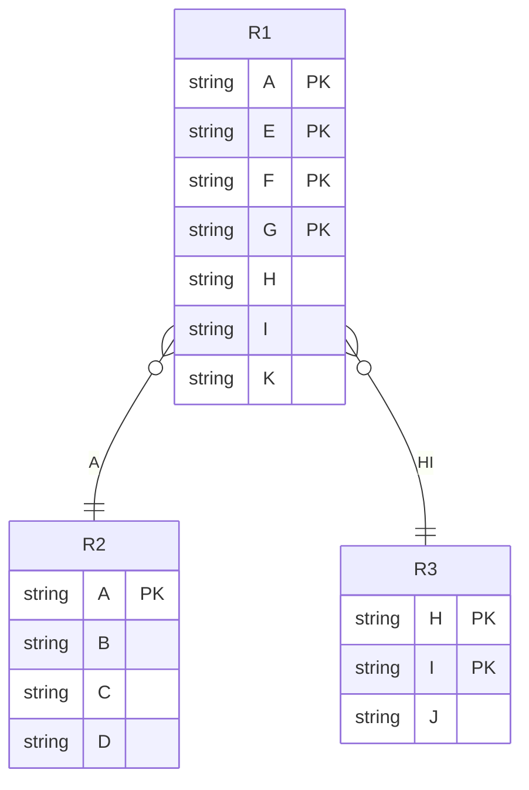

```SQL
create or alter trigger updStuCreditOnInsUpd  
on takes  
after insert, update  
as  
begin
	if (ROWCOUNT_BIG() = 0) return;  
	if exists (
		select grade
			from inserted as i
			where (i.grade is not null)
	)
	begin
		set nocount on;
		update student
			set tot_cred = tot_cred + 
				case 
	                when
		                (i.grade not in ('D-','F')
							and
						(d.grade IS NULL or d.grade in ('D-','F')))
					then c.credits
	                when
		                (i.grade in ('D-','F')
							and
						d.grade not in ('D-','F')
					then -c.credits
	                else 0
	            end
			from student as s
			inner join inserted as i
				on s.id = i.id
			left join deleted as d
				on d.id = i.id and d.course_id = i.course_id
			inner join course as c
				on i.course_id = c.course_id;
	end;
end;
```
^1


^6g
