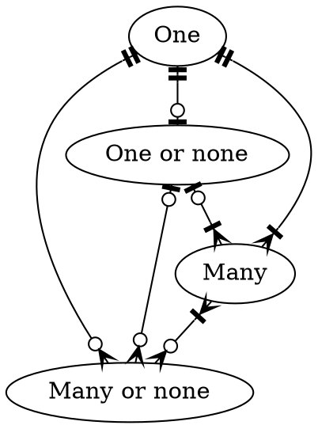
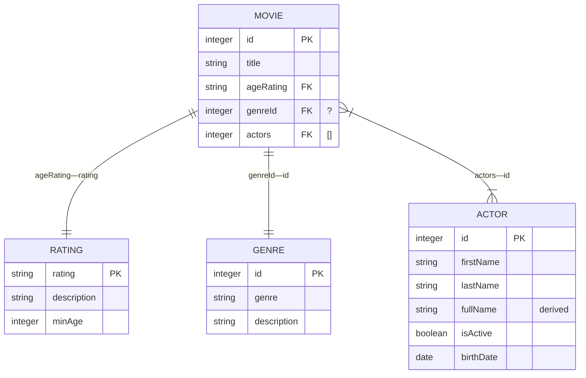

# Relational Databases

## Relations

Relations (or tables) are sets of data with metadata describing what data belongs, what type it is, and how it relates to other data, as well as the raw data itself.

### Attributes

Denoted $A_j$

Attributes (or columns) of relations contain:
- The name of the column
- Its domain and datatype — controlling valid values

#### Types of Attributes

> [!def]
> **Composite Attribute**: An attribute consisting of multiple other attributes
> **Simple Attribute**: An atomic attribute
> **Single-value Attribute**: An attribute that may only hold one value
> **Derived Attribute**: An attribute that is calculated from other attributes
> **Multi-valued Attributes**: An attribute that may hold multiple (or no) values

### Relation Schema

Denoted $R=(A_{1}, A_{2}, A_{3}, ... A_{n})$

A set of attributes that define the relation. Often the first attribute will be an ID column for uniquely identifying rows.

### Relation Instance

Denoted $r(R)$

An actual instance of a relation is a table, which can store and update data

Tuples within tables are unique and **unordered**.

### Attribute Values

Attribute values are the specific value of a tuple instance for a certain attribute. Namely the actual data associated between a tuple and an attribute

- Typically must be atomic (indivisible)
- null is part of every domain

### Tuples

Tuples are the rows in a table, a particular entry or instance of data

An instance that satisfies all restraints and domains in the database is called a legal instance of the relation

### Database Instance

A snapshot of all data in a particular relational database at a particular moment in time

A database that has all tuples as legal instances, and has a key (a column with unique identifiable values for each row) is a legal instance of a database

#### Keys

Let $R$ be a relation schema
$\alpha, \beta\in R$

The **functional dependency**
$\alpha(\text{determinant})\to\beta(\text{dependent})\iff t_1[\alpha]=t_2[\alpha]\implies t_1[\beta]=t_2[\beta]$
Where $\alpha$ is the key and $t_1,t_2$ are legal tuples

##### Types of Keys

> [!Def]
> **Super Key**: one or more attributes that uniquely identify a row
> **Candidate Key**: a minimal set of attributes that uniquely identify a row
> - $CK\to R$
> - $\forall \alpha\subset K:\alpha\not\to R$
> 
> **Primary Key**: the key chosen by the database to uniquely identify a row (will be a CK)
> **Composite Key**: a key composed of multiple attributes
> **Foreign Key**: a key to another table, being stored as a relational attribute from the original table

## Entity-Relationship Model

> [!Def]
> **Entity**: a thing or object that is identifiable
> **Relationship**: an association amongst entities
> **ER Diagram**: A graphic displaying the logic of relations between entities

### Mapping Cardinalities

Mappings from one; zero or one; one or more; or zero or more attributes to other attribute(s).

### ERD Models

There are two common ERD model systems: Crow's Foot and Chen's

#### Crow's Foot





#### Chen's

Is kinda dumb, uses diamonds for relations, squares for tables, circles for attributes of tables or relational tables.

Lines between tables and relations may be solid or dotted, with dotted meaning optional. These lines must also be marked with a "1" or an "M".

## Relational Algebra

### Select

Often represented as $\sigma_a(t)$

The select operator filters all tuples from a table by a particular predicate.

The predicate is often the subscript of the operator, such as:

$\sigma_{attribute=a}(table)$

In SQL, this is more commonly known as the $\text{WHERE}$ clause, for example:

```SQL
SELECT * FROM table WHERE attribute="a";
```

### Project

Often represented as $\Pi_a(t)$

The project operator selects attributes of tuples to return, instead of returning them all.

The predicate is also in the subscript of the operator

$\Pi_{attr1,attr2}(table)$

In SQL, this is more commonly known as the $\text{SELECT}$ clause

```SQL
SELECT attr1, attr2 FROM tablename;
```

### Cartesian Product

The Cartesian product, represented as $t\times t$, takes all combinations of tuples in one table with all tuples in another table.

$table1\times table2$

Would return a number of tuples equal to the product of the number of tuples in the two tables, as every combination between the two tables are tuples in the output.

In SQL, the Cartesian product is implied when selecting from multiple tables or using the $\text{JOIN}$ clause

```SQL
SELECT table1.*, table2.* FROM table1, table2;
SELECT table1.attr1, table2.attr2 FROM table1 JOIN table2 ON table1.t2=table2.t1;
```

### Join

The binary join operation is denoted with $t\bowtie_{a}t$, with a relational predicate in the subscript.

$table1\bowtie_{table1.attr1=table2.attr2}table2$

The join operation is a combination of the Cartesian product and a condition through an $\text{ON}$ clause or a $\text{WHERE}$ clause

### Assignment

The assignment operator, represented as $v\leftarrow n$, creates a variable with that name, storing a value.

$variable \leftarrow 1$

In SQL, this would be the equivalent of a variable, temporary table, or table variable

```SQL
DECLARE @FloatVar AS FLOAT = 12312.1232;
```

Temporary tables must begin with $\#$, with global temporary tables starting with $\#\#$. Temporary tables support all the same features a normal table would, but would only last for the session the table was created in.

```SQL
SELECT attribute INTO #temporary_table FROM tablename
```
Table variables are variables that are tables (namely). Table variables may be treated like a normal table mostly. They do not support all the SQL functions that a regular table would have, but is useful for small amounts of data.

```SQL
DECLARE @TABLE_VAR TABLE
(column_1 DATATYPE, 
 column_2 DATATYPE, 
 column_N DATATYPE
)
```
### Rename

Represented as $\rho_{a(b)}(t)$, rename selects the $b$ attributes from table $t$ and renames them as $a$

$\rho_{t2(attr1, attr2)}(table)$

In SQL, this would be the $\text{AS}$ clause, where you can call attributes or tables by a different name.

```SQL
SELECT attr1, attr2 AS newattr FROM tablename;
SELECT a.attr1, b.attr2 FROM tablename AS a, tablename AS b;
```

