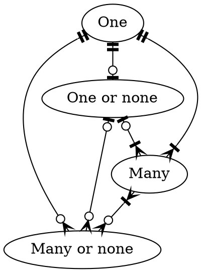
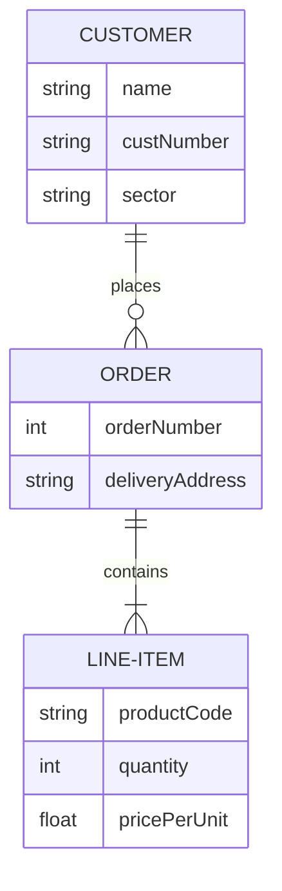

# Relational Databases

## Relations

Relations (or tables) are sets of data with metadata describing what data belongs, what type it is, and how it relates to other data, as well as the raw data itself.

### Attributes

Denoted $A_j$

Attributes (or columns) of relations contain:
- The name of the column
- Its domain and datatype — controlling valid values

#### Types of Attributes

> [!def]
> **Composite Attribute**: An attribute consisting of multiple other attributes
> **Simple Attribute**: An atomic attribute
> **Single-value Attribute**: An attribute that may only hold one value
> **Derived Attribute**: An attribute that is calculated from other attributes
> **Multi-valued Attributes**: An attribute that may hold multiple (or no) values

### Relation Schema

Denoted $R=(A_{1}, A_{2}, A_{3}, ... A_{n})$

A set of attributes that define the relation. Often the first attribute will be an ID column for uniquely identifying rows.

### Relation Instance

Denoted $r(R)$

An actual instance of a relation is a table, which can store and update data

Tuples within tables are unique and **unordered**.

### Attribute Values

Attribute values are the specific value of a tuple instance for a certain attribute. Namely the actual data associated between a tuple and an attribute

- Typically must be atomic (indivisible)
- null is part of every domain
### Tuples

Tuples are the rows in a table, a particular entry or instance of data

An instance that satisfies all restraints and domains in the database is called a legal instance of the relation

### Database Instance

A snapshot of all data in a particular relational database at a particular moment in time

A database that has all tuples as legal instances, and has a key (a column with unique identifiable values for each row) is a legal instance of a database

#### Keys

Let $R$ be a relation schema
$\alpha, \beta\in R$

The **functional dependency**
$\alpha(\text{determinant})\to\beta(\text{dependent})\iff t_1[\alpha]=t_2[\alpha]\implies t_1[\beta]=t_2[\beta]$
Where $\alpha$ is the key and $t_1,t_2$ are legal tuples

##### Types of Keys

> [!Def]
> **Super Key**: one or more attributes that uniquely identify a row
> **Candidate Key**: a minimal set of attributes that uniquely identify a row
> - $CK\to R$
> - $\forall \alpha\subset K:\alpha\not\to R$
> 
> **Primary Key**: the key chosen by the database to uniquely identify a row (will be a CK)
> **Composite Key**: a key composed of multiple attributes
> **Foreign Key**: a key to another table, being stored as a relational attribute from the original table

## Entity-Relationship Model

> [!Def]
> **Entity**: a thing or object that is identifiable
> **Relationship**: an association amongst entities
> **ER Diagram**: A graphic displaying the logic of relations between entities

### Mapping Cardinalities

Mappings from one; zero or one; one or more; or zero or more attributes to other attribute(s).

### ERD Models

There are two common ERD model systems: Crow's Foot and Chen's

#### Crow's Foot

#### Chen's

Is kinda dumb, uses diamonds for relations, squares for tuples, circles for attributes

