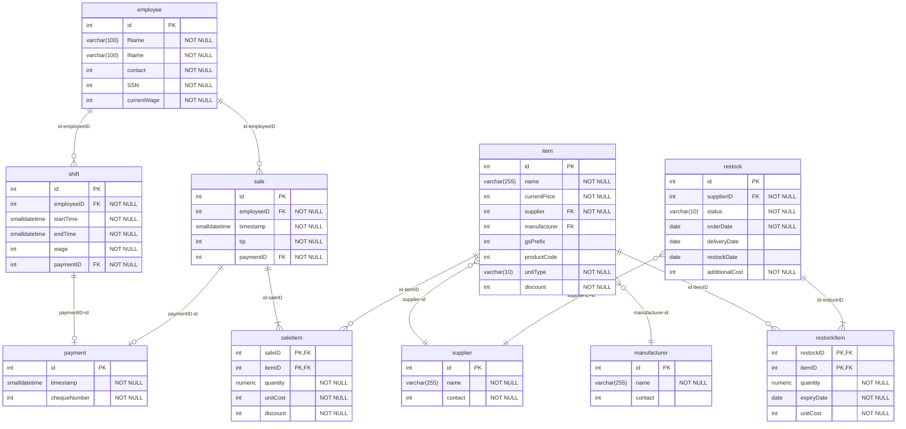

```mermaid
erDiagram
	item {
		int id PK
		varchar(255) name "NOT NULL"
		int currentPrice "NOT NULL"
		int supplier FK "NOT NULL"
		int manufacturer FK
		int gsPrefix
		int productCode
		varchar(10) unitType "NOT NULL"
		int discount "NOT NULL"
	}
	manufacturer {
		int id PK
		varchar(255) name "NOT NULL"
		int contact
	}
	supplier {
		int id PK
		varchar(255) name "NOT NULL"
		int contact "NOT NULL"
	}
	employee {
		int id PK
		varchar(100) fName "NOT NULL"
		varchar(100) lName "NOT NULL"
		int contact "NOT NULL"
		int SSN "NOT NULL"
		int currentWage "NOT NULL"
	}
	sale {
		int id PK
		int employeeID FK "NOT NULL"
		smalldatetime timestamp "NOT NULL"
		int tip "NOT NULL"
		int paymentID FK "NOT NULL"
	}
	shift {
		int id PK
		int employeeID FK "NOT NULL"
		smalldatetime startTime "NOT NULL"
		smalldatetime endTime "NOT NULL"
		int wage "NOT NULL"
		int paymentID FK "NOT NULL"
	}
	payment {
		int id PK
		smalldatetime timestamp "NOT NULL"
		int chequeNumber "NOT NULL"
	}
	saleItem {
		int saleID PK,FK
		int itemID PK,FK
		numeric quantity "NOT NULL"
		int unitCost "NOT NULL"
		int discount "NOT NULL"
	}
	restock {
		int id PK
		int supplierID FK "NOT NULL"
		varchar(10) status "NOT NULL"
		date orderDate "NOT NULL"
		date deliveryDate
		date restockDate
		int additionalCost "NOT NULL"
	}
	restockItem {
		int restockID PK,FK
		int itemID PK,FK
		numeric quantity "NOT NULL"
		date expiryDate "NOT NULL"
		int unitCost "NOT NULL"
	}
	item }o--|| supplier : "supplier-id"
	item }o--|| manufacturer : "manufacturer-id"
	employee ||--o{ sale : "id-employeeID"
	employee ||--o{ shift : "id-employeeID"
	shift ||--o| payment : "paymentID-id"
	sale ||--o| payment : "paymentID-id"
	sale ||--|{ saleItem : "id-saleID"
	item ||--o{ saleItem : "id-itemID"
	restock }o--|| supplier : "supplierID-id"
	item ||--o{ restockItem : "id-itemID"
	restock ||--|{ restockItem : "id-restockID"
```
