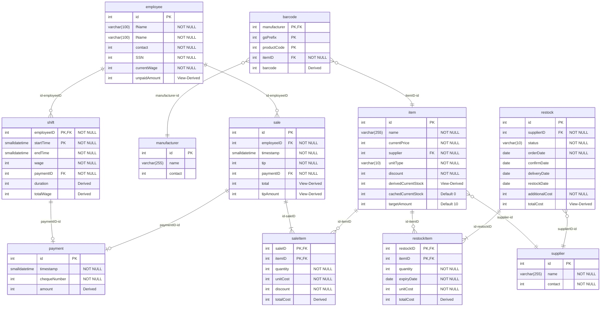

```mermaid
erDiagram
	barcode {
		int manufacturer PK, FK
		int gsPrefix PK
		int productCode PK
		int itemID FK "NOT NULL"
		int barcode "Derived"
	}
	item {
		int id PK
		varchar(255) name "NOT NULL"
		int currentPrice "NOT NULL"
		int supplier FK "NOT NULL"
		varchar(10) unitType "NOT NULL"
		int discount "NOT NULL"
		int derivedCurrentStock "View-Derived"
		int cachedCurrentStock "Default 0"
		int targetAmount "Default 10"
	}
	manufacturer {
		int id PK
		varchar(255) name
		int contact
	}
	supplier {
		int id PK
		varchar(255) name "NOT NULL"
		int contact "NOT NULL"
	}
	employee {
		int id PK
		varchar(100) fName "NOT NULL"
		varchar(100) lName "NOT NULL"
		int contact "NOT NULL"
		int SSN "NOT NULL"
		int currentWage "NOT NULL"
		int unpaidAmount "View-Derived"
	}
	sale {
		int id PK
		int employeeID FK "NOT NULL"
		smalldatetime timestamp "NOT NULL"
		int tip "NOT NULL"
		int paymentID FK "NOT NULL"
		int total "View-Derived"
		int tipAmount "View-Derived"
	}
	shift {
		int employeeID PK,FK "NOT NULL"
		smalldatetime startTime PK "NOT NULL"
		smalldatetime endTime "NOT NULL"
		int wage "NOT NULL"
		int paymentID FK "NOT NULL"
		int duration "Derived"
		int totalWage "Derived"
	}
	payment {
		int id PK
		smalldatetime timestamp "NOT NULL"
		int chequeNumber "NOT NULL"
		int amount "Derived"
	}
	saleItem {
		int saleID PK,FK
		int itemID PK,FK
		int quantity "NOT NULL"
		int unitCost "NOT NULL"
		int discount "NOT NULL"
		int totalCost "Derived"
	}
	restock {
		int id PK
		int supplierID FK "NOT NULL"
		varchar(10) status "NOT NULL"
		date orderDate "NOT NULL"
		date confirmDate
		date deliveryDate
		date restockDate
		int additionalCost "NOT NULL"
		int totalCost "View-Derived"
	}
	restockItem {
		int restockID PK,FK
		int itemID PK,FK
		int quantity "NOT NULL"
		date expiryDate "NOT NULL"
		int unitCost "NOT NULL"
		int totalCost "Derived"
	}
	barcode }o--|| manufacturer : "manufacturer-id"
	barcode }o--|| item : "itemID-id"
	item }o--|| supplier : "supplier-id"
	employee ||--o{ sale : "id-employeeID"
	employee ||--o{ shift : "id-employeeID"
	shift ||--o| payment : "paymentID-id"
	sale ||--o| payment : "paymentID-id"
	sale ||--|{ saleItem : "id-saleID"
	item ||--o{ saleItem : "id-itemID"
	restock }o--|| supplier : "supplierID-id"
	item ||--o{ restockItem : "id-itemID"
	restock ||--|{ restockItem : "id-restockID"
```
