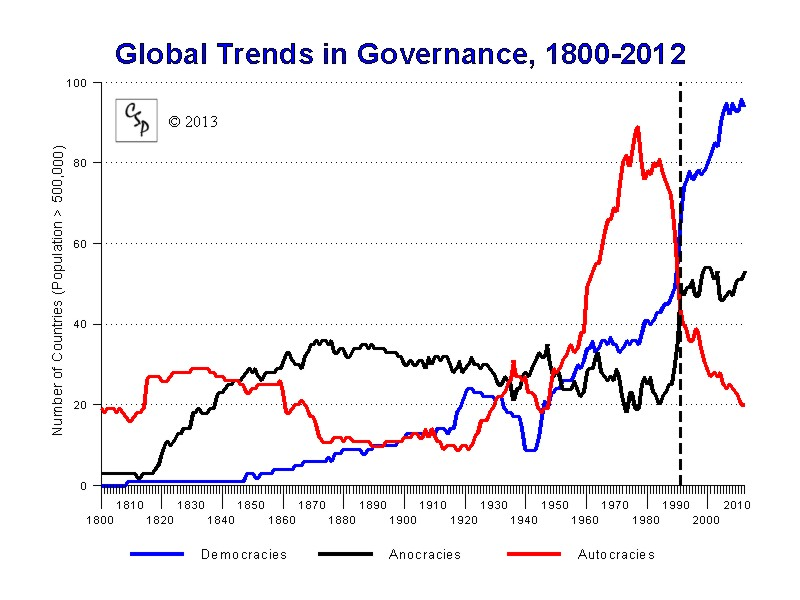
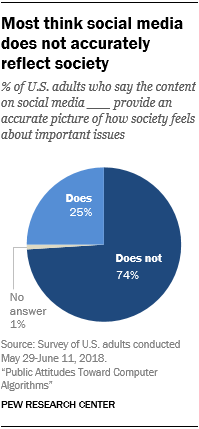

# Social Issues
## Forms of Government
In 2008, Nepal abolished its Monarchy and switched to a Democratic system, but this change took over 9 years and was after much turmoil and disrest. This trend can be seen around the world as well, showing a large shift from other forms of government to democracy with an especially large bump following WWII as seen in the following graphic:

Do you think that the benefits of democracy outweigh the costs of transitioning to it, if so, what ideals about it is so essential that demands such a drastic change, and how do these ideals fare biblically?

## Freedom of Speech
Freedom of Speech is highly regarded out of the several idealistic freedoms valued in the west. Freedom of Speech is often debated widely in the context of modern social media platforms using algorithms to recommend, but also hide certain content. According to a pew research study conducted in 2018:

A hypermajority of people do not believe social media is an accurate description of real life. Additionally, often with greater freedom of speech comes more false information. Algorithms may be able to bias for the "truth", but biasing for what is "true" and censoring what is "false" is a clear violation of freedom of speech.

Do you believe that algorithms - designed not for equal representation of ideas, but to interest the viewer - are a violation of freedom of speech, and how does the desire to want to be entertained stack up against the right of freedom of speech on a societal level? With complete freedom of speech, how will the combat of "false" information be implemented, if at all?

## Immigration
On May 1, 2020 Malaysia stopped accepting boats carrying Rohingyan refugees into Malaysia. These people are undocumented and cannot travel far, much less legally. Many locals believe that these immigrants cause problems to our economy and culture. Even with refugee agreements which many countries have signed, how do you think countries should handle the case of undocumented immigration of refugees?

## Political Correctness
On the spectrum of "snowflakes" to "thick-skinned", political correctness aims to form a concrete manner for people to respect the "snowflakes". Assuming that over time, the "judgement line" of political correctness has gotten stricter, how far too far for being respectful of people? Is it okay to expect people to be thick-skinned to a certain point?

## Racism
"The Civil Rights Act of 1964 made it illegal to discriminate against students and college applicants on the basis of race or gender" (FindLaw). No matter how many laws are put in place to prevent systemic racism, racism on a social level cannot be governed so easily. Even when the Civil Rights Act of 1964 was proven ineffective at preventing systemic racism in multiple instances, how do you think racism should be tackled on the social level?
