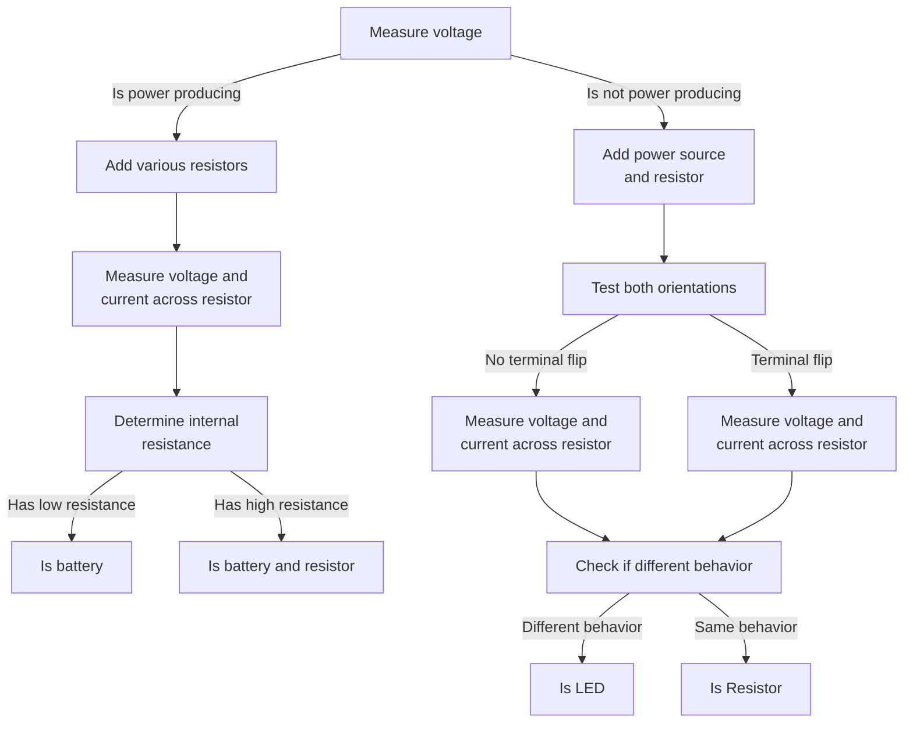

```mermaid
flowchart TD
	a["Measure voltage"]
	aa["Add various resistors"]
	ab["Add power source
	and resistor"]
	a -->|Is power producing| aa
	a -->|Is not power producing| ab
	
	aaa["Measure voltage and
	current across resistor"]
	aa --> aaa
	aaaa["Determine internal
	resistance"]
	aaa --> aaaa
	aaaaa["Is battery"]
	aaaab["Is battery and resistor"]
	aaaa -->|Has low resistance| aaaaa
	aaaa -->|Has high resistance| aaaab
	
	aba["Test both orientations"]
	ab --> aba
	abaa["Measure voltage and
	current across resistor"]
	abab["Measure voltage and
	current across resistor"]
	aba -->|No terminal flip| abaa
	aba -->|Terminal flip| abab
	
	abaaa["Check if different behavior"]
	abaa --> abaaa
	abab --> abaaa
	
	abaaaa["Is LED"]
	abaaa -->|Different behavior| abaaaa
	
	abaaab["Is Resistor"]
	abaaa -->|Same behavior| abaaab
```
